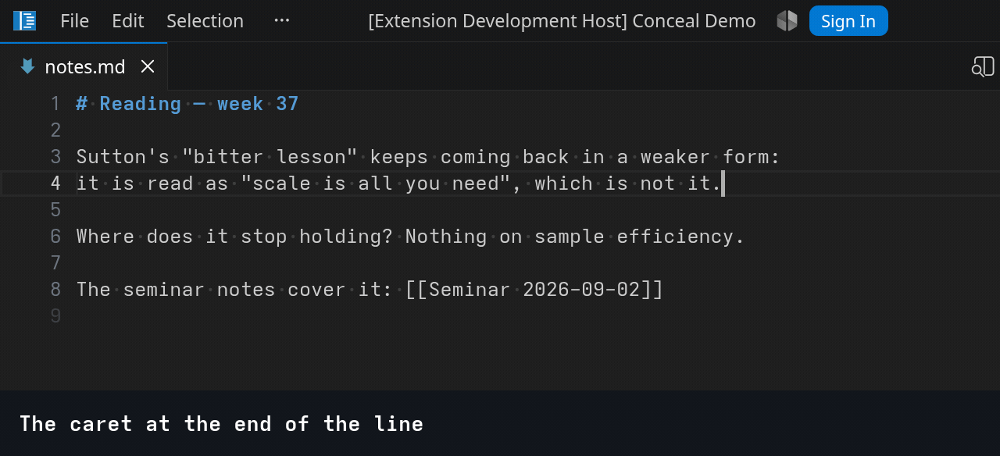
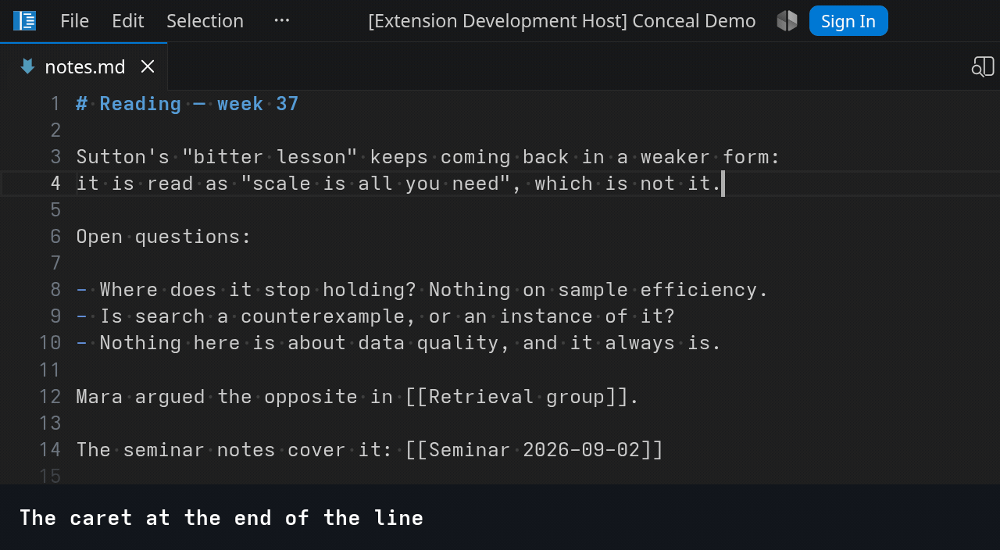
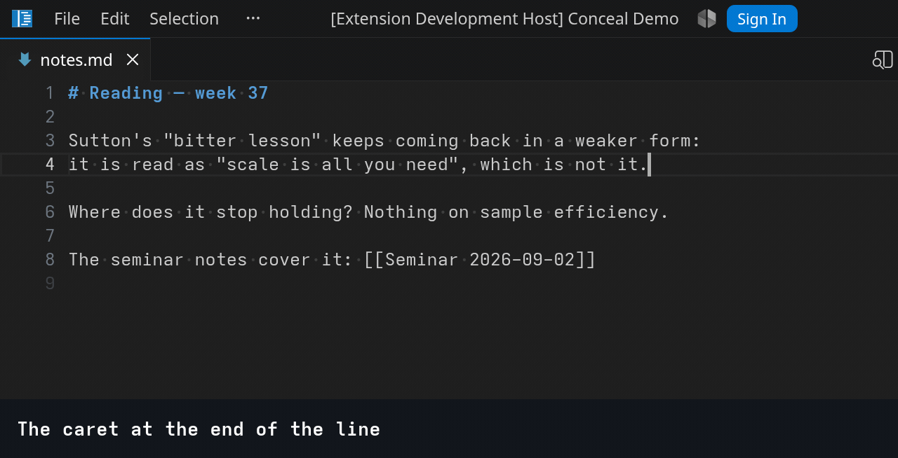

# Conceal Demo

A showcase of the VS Code **conceal decoration options**.

## Links

1. Proposal: [Concealed text — a proposed VS Code API (v4) · GitHub](https://gist.github.com/heyzling/6235fd30bda7605199963e15f12142f5)
1. Implementation: [VS Code Fork conceal-1.135 branch](https://github.com/heyzling/vscode/tree/concealed-text-1.135)
1. Demo: [VS Code Conceal Demo extension](https://github.com/heyzling/vscode-conceal-demo)
   > Its README has GIFs demonstrating the implemented behavior.
1. 2023, motivating request, still open, Backlog, 60 👍: [#171074 Feature request: prettify symbols mode](https://github.com/microsoft/vscode/issues/171074)


## Run

```bash
npm install
CONCEAL_DEMO_FORK=/path/to/vscode-fork ./scripts/dev.sh   # opens examples/ in the fork
```

ON/OFF concealment via command: `Conceal Demo: Toggle Concealment`.

## 1 — Tags

**Shows:**
- text -> glyph replacement
- cursor movement
- `deletionPolicy: atomic` behavior

**Paths:**
- Logic: [src/cases/01-tags/tags.ts](src/cases/01-tags/tags.ts)
- Example: [examples/01-tags/tags.md](examples/01-tags/tags.md)

**What it does:**
Replaces `#done` with one-symbol and `#bug` with multicharacter glyphs. "Tags to emoji" case is chosen as the most recognizable one. So specific LateX, or F# lamda syntax won't scare people. Replacement are really could be anything. See below to "Other Examples" section.

**Conceal decoration shape for this example**
```ts
const doneDecoration = vscode.window.createTextEditorDecorationType({
  rangeBehavior: vscode.DecorationRangeBehavior.ClosedClosed,
  conceal: { replacement: { contentText: "✅" } },
});

const bugDecoration = vscode.window.createTextEditorDecorationType({
  rangeBehavior: vscode.DecorationRangeBehavior.ClosedClosed,
  conceal: {
    replacement: {
      contentText: "🐞 bug",
      color: new vscode.ThemeColor("charts.red"),
      backgroundColor: new vscode.ThemeColor("editorInlayHint.background"),
      borderRadius: "3px",
    },
  },
});

editor.setDecorations(doneDecoration, findRanges(editor.document, /#done\b/g));
```

**Concealment on and off**


**Write tag**


**Search finds the text under the glyph**


**What the clipboard carries**


**The cursor around a glyph**


**A cursor inside the range when concealment returns**


**Deleting a glyph**


**Two cursors, two glyphs**


**The cursor up and down through glyph lines**


## 2 — Dynamic replacement

Shows:
- dynamic text replacement
- `deletionPolicy: reveal`


[src/cases/02-i18n/i18n.ts](src/cases/02-i18n/i18n.ts) · [examples/02-i18n/comments.ts](examples/02-i18n/comments.ts) · [examples/02-i18n/checkout.ts](examples/02-i18n/checkout.ts)

This case shows ability to use conceal options to replace one text with another:
- TS code with static values underneath replaced with said values.
- Comments in Spanish replaced with English translation

Imitated with hardcoded JSON-config, but in real extension values can arrive from anywhere: a translation service, a language server, a bibliography, etc. 

Here is where `deletionPolicy: reveal` works great. Often you don't want to delete the whole replacement at once like in tags example. You want to edit real text underneath. This policy automatically reveals real text on Backspace/Delete against concealed range.

**Extensions today:**
[Comment Translate](https://marketplace.visualstudio.com/items?itemName=intellsmi.comment-translate),
701k installs.
[i18n Ally](https://marketplace.visualstudio.com/items?itemName=Lokalise.i18n-ally), 1.03M installs.
[stuck brackets, an invisible cursor,
undefined lines](https://github.com/lokalise/i18n-ally/issues/1215).

| The editor does | The extension does |
| --- | --- |
| hides the range and draws the string given for that one range | reads the catalogue and maps what is written → what is drawn |
| keeps the cursor out: one press crosses it, one delete takes it whole, so no projection has to be dropped near the cursor | re-applies when a catalogue changes, saved or not |
| keeps copy, search and diff on what is really written | leaves an unanswered string visible, and hovers the original under a translation |

```ts
// One type for every string drawn: only the replacement varies, and it travels with the range.
const translationDecoration = vscode.window.createTextEditorDecorationType({
  rangeBehavior: vscode.DecorationRangeBehavior.ClosedClosed,
  conceal: { deletionPolicy: "reveal" },
});

editor.setDecorations(translationDecoration, matches.map((match) => ({
  range: match.range,
  renderOptions: { conceal: { replacement: { contentText: catalogue[match.text] } } },
  hoverMessage: `\`${match.text}\``,
})));
```

## 3 — Invisible metadata

Shows:
- concealment with nothing drawn in its place
- `anchor: lineEnd`
- `deletionPolicy: protect`

[src/cases/03-invisible-metadata/metadata.ts](src/cases/03-invisible-metadata/metadata.ts) · [examples/03-invisible-metadata/notes.md](examples/03-invisible-metadata/notes.md)

Machine data written into a file by something other than the person reading it: Obsidian block
ids — `^a3f9c1` closing a block, `[[Note#^id]]` inside a link. Written when you copy a link to a
block, never typed by hand.

Nothing is drawn in their place, so a concealed range takes no room and holds no cursor position:
one press carries the cursor past it and on to the next character it can see, and a line is as long
as it looks.

An id is anchored to the end of its line. Its one cursor stop is at the visible end of the line,
so text typed there goes in front of the id, and Enter there opens the next line while the id stays
on the line it closes. Without the anchor one of the two goes wrong whichever side the stop is on:
typed text lands behind the id, or Enter carries the id down onto the new line.

An id is also `protect`: a delete steps over it, so a Backspace at the end of a line takes the
sentence, not the id it cannot see.

**Elsewhere:** Obsidian's Live Preview draws block ids as dimmed labels and hides them only in
Reading view; users who hide them with CSS report the cursor walking the invisible characters and
typing landing behind the id. Logseq keeps its `id::` on a line of its own, which is the whole-line
case this repository leaves out.

| The editor does | The extension does |
| --- | --- |
| hides the range and draws nothing, so the line is as short as it looks | finds the ids |
| collapses it to one cursor position, crossed in one press, never landed inside | marks them anchored and protected |
| keeps a line break typed at the line end behind the id, and typed text in front of it | re-applies on every edit |
| keeps save, copy, search and diff on the real text | |

```ts
const idDecoration = vscode.window.createTextEditorDecorationType({
  conceal: { anchor: "lineEnd", deletionPolicy: "protect" },
});
```

**Block ids on and off**


**The cursor crosses an id**


**A delete skips an id**



**A word typed at the line end**



**Enter at the line end**



**What the clipboard carries**


## 4 — Markup

Shows:
- concealment of a pair with nothing drawn in its place
- `anchor: after` on the opening marker, `anchor: before` on the closing one
- `deletionPolicy: protect`
- a link drawn as its text: per-range `replacement`, `deletionPolicy: reveal`

[src/cases/04-markup/markup.ts](src/cases/04-markup/markup.ts) · [examples/04-markup/emphasis.md](examples/04-markup/emphasis.md)

Markdown emphasis: `**bold**`, `_italic_` and `` `code` `` read as the styled word alone. The
oldest conceal case there is, and the one where the editor's part matters most, because the hidden
text wraps text that is being edited.

Each marker belongs to the text it wraps. The opening `**` belongs to the word behind it, so its one
cursor stop is behind the marker: a letter typed at the visible start of `bold` is bold. The closing
`**` belongs to the word in front, so its stop is in front of the marker: a letter typed at the
visible end of `bold` is bold too. Enter or a space typed at either stop lands *outside* the pair,
so the emphasis closes before the line breaks and `**bold **` is never written. Without the anchors
the cursor would collapse to the arrival side of each marker, and one of the two edges would put
typed text outside the pair.

`protect` keeps the delete keys off the markers: Backspace at the visible end takes the letter,
Delete there steps over the closing marker and takes the character behind it. That makes a pair
unremovable by ordinary editing, which is the point, and the extension owes the user another route —
`Ctrl+B` unwrapping the word, its job anyway since only it knows what a pair spans. This demo does
not implement it.

Both markers are hidden from a live parse — here one regular expression per kind, each matching a
whole pair — so a marker that loses its partner stops matching and stays in view: the file stopped
being valid markdown and the screen says so.

A link is the other kind of thing. `[CommonMark spec](https://commonmark.org/)` is one unit,
concealed whole with its text drawn in its place, blue and underlined the way a browser draws it.
The drawn text predicts nothing about the url, so this is `reveal`, as in case 2: a delete key
beside the link shows all of it and takes nothing, the next press edits what it showed, and once
the cursor leaves, the link is drawn again over whatever it now says. The url stays reachable on
hover.

**Elsewhere:** Vim's markdown conceal, Org mode's `org-hide-emphasis-markers`, Obsidian's Live
Preview, Typora.

| The editor does | The extension does |
| --- | --- |
| hides both markers and draws nothing, so `**bold**` reads as `bold` | finds the pairs — a parse, one regular expression per kind here |
| one cursor stop per marker, on the inside of the pair: typing at either visible edge stays inside | styles the text between them: bold, italic, code |
| Enter or a space at either edge lands outside the pair, so the emphasis closes first | re-applies on every edit, so an orphan marker shows itself |
| Backspace and Delete take the visible neighbours and step over a marker | removes a pair as a command, since only it knows what the pair spans |
| draws a link's text over the whole link, shows the link on a delete key beside it and hides it again when the cursor leaves | picks what a link draws: its text, blue, underlined, with the url on hover |

```ts
const openingDecoration = vscode.window.createTextEditorDecorationType({
  conceal: { anchor: "after", deletionPolicy: "protect" },
});

const closingDecoration = vscode.window.createTextEditorDecorationType({
  conceal: { anchor: "before", deletionPolicy: "protect" },
});

const boldDecoration = vscode.window.createTextEditorDecorationType({ fontWeight: "bold" });

// A link is one range drawing its own text; the drawn text predicts nothing about the url.
const linkDecoration = vscode.window.createTextEditorDecorationType({
  conceal: { deletionPolicy: "reveal" },
});

// Every pair as its opener, text and closer, from one expression per kind: /\*\*([^*]+)\*\*/g
const found = pairs(editor.document);
editor.setDecorations(openingDecoration, found.map((pair) => pair.opener));
editor.setDecorations(closingDecoration, found.map((pair) => pair.closer));
editor.setDecorations(boldDecoration, found.filter((pair) => pair.kind === "bold").map((pair) => pair.text));

// Every `[text](url)`, drawn as its text.
editor.setDecorations(linkDecoration, links(editor.document).map(({ range, text, url }) => ({
  range,
  renderOptions: { conceal: { replacement: { contentText: text, color: new vscode.ThemeColor("textLink.foreground"), textDecoration: "underline" } } },
  hoverMessage: url,
})));
```

**Markers on and off**


**A hidden marker costs no keypress**


**Typing at either visible edge stays inside the pair**


**A space at the visible end lands outside the pair**


**Enter at the visible end leaves the pair whole**


**No delete key reaches a marker**


**A marker without a partner shows itself**


**A link shows itself on Backspace and hides again**


## 5 — Gallery

Small examples, one file each under [src/cases/05-gallery](src/cases/05-gallery): a regular
expression, a decoration type, an example file under [examples/05-gallery](examples/05-gallery),
and nothing else. One recording each, concealment on throughout — what the API looks like while
you work.

**JSON keys** — `"name":` reads as `name:`. The quotes are grammar, so they are `protect`ed, and
each is anchored to its key: typing at the visible end of a key stays inside the quotes.
[jsonKeys.ts](src/cases/05-gallery/jsonKeys.ts) · [config.json](examples/05-gallery/config.json)


**F# lambda** — `fun` as λ, `->` as →, drawn the moment they are typed.
[fsharpLambda.ts](src/cases/05-gallery/fsharpLambda.ts) · [lambda.fs](examples/05-gallery/lambda.fs)


**TS arrow** — `=>` as one ⇒.
[tsArrow.ts](src/cases/05-gallery/tsArrow.ts) · [arrow.ts](examples/05-gallery/arrow.ts)


**LaTeX macros** — `\alpha` as α, from a table. `reveal`: Backspace on α shows `\alpha` and
takes nothing; the next press edits the macro one character at a time.
[latexMacros.ts](src/cases/05-gallery/latexMacros.ts) · [formula.tex](examples/05-gallery/formula.tex)


**Tag rotation** — `#todo` as ⬜, `#done` as ✅. A click on the glyph rewrites the tag to the
other one, as does `Conceal Demo: Rotate Tag` at the cursor; the rewrite is the extension's edit,
since a click on drawn text only puts the cursor at its edge. The recording uses the command —
nothing in the pipeline can move the mouse.
[tagRotation.ts](src/cases/05-gallery/tagRotation.ts) · [todo.md](examples/05-gallery/todo.md)


**Inline fold** — a `class` value longer than 30 characters folded to a `•••` chip. The chip
predicts nothing about the value, so this is `reveal` again: Backspace beside it shows the value
and takes nothing, the next keys edit it, and the cursor leaving folds it again. A folded row is as
short as it looks and the cursor cannot fall into the fold, the two things the CSS trick cannot do:
[Inline Fold](https://marketplace.visualstudio.com/items?itemName=moalamri.inline-fold), 305k
installs, and [Tailwind Fold](https://marketplace.visualstudio.com/items?itemName=stivo.tailwind-fold),
337k, hide the characters and draw `…` — the hidden characters keep their room under word wrap
([inline-fold#69](https://github.com/moalamri/vscode-inline-fold/discussions/69)), arrow keys walk
through them ([inline-fold#119](https://github.com/moalamri/vscode-inline-fold/issues/119)), and
both are unmaintained ([inline-fold#132](https://github.com/moalamri/vscode-inline-fold/discussions/132)).
VS Code folds whole lines only: [microsoft/vscode#50840](https://github.com/microsoft/vscode/issues/50840),
171 👍, open since 2018, answered three times with "needs the editor core".
[fold.ts](src/cases/05-gallery/fold.ts) · [card.html](examples/05-gallery/card.html)


## Recording

The GIFs are played by the extension's own recorder and photographed by
[scripts/record.sh](scripts/record.sh) on WSLg; its header lists the requirements.

```bash
CONCEAL_DEMO_FORK=/path/to/vscode-fork CONCEAL_DEMO_WINSHOT=/path/to/winshot.ps1 \
  ./scripts/record.sh 05         # case 5; `0501 0506` picks scenes
```

A step marked `manual` in [examples/scenes.jsonc](examples/scenes.jsonc) is filmed by hand: the
recorder sets the scene up and sizes the window, the Windows ffmpeg films the workbench rectangle
with the pointer in it until Enter is pressed in the terminal, and the clip gets its caption like
any frame. That is how the mouse scenes are made, since nothing in the pipeline can move the mouse.

A scene that shows another extension beside the API needs it installed: the pinned ones in
[scripts/compare-extensions.txt](scripts/compare-extensions.txt) go into the recording profile unless
`CONCEAL_DEMO_NO_COMPARE=1` is set, and every scene states with a setting whether that extension is on.

Every scene is also an end-to-end test. `npm run test:fork` plays each one in the fork with nothing
photographed and checks every step's `expect` — cursor, selection, lines, the text pasted beside —
against what its GIF shows; see [docs/setup.md](docs/setup.md).
