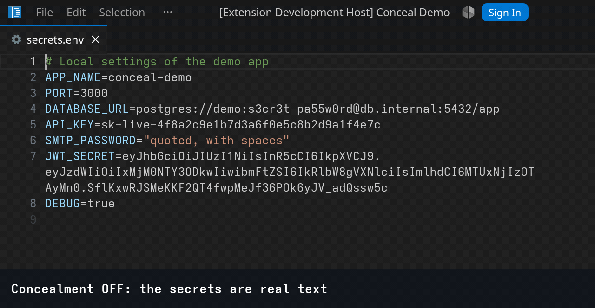
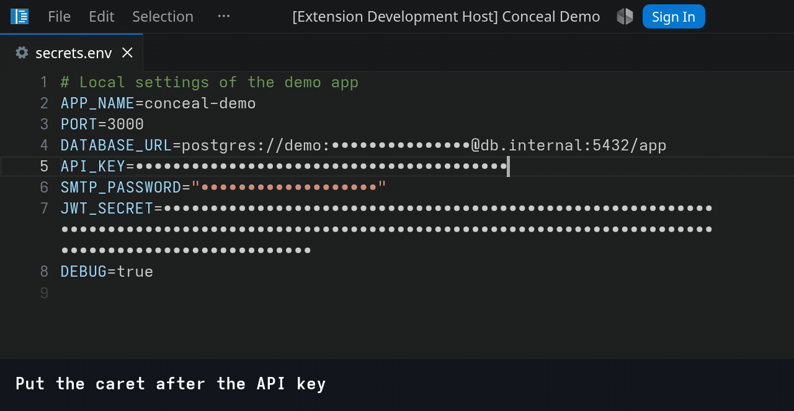
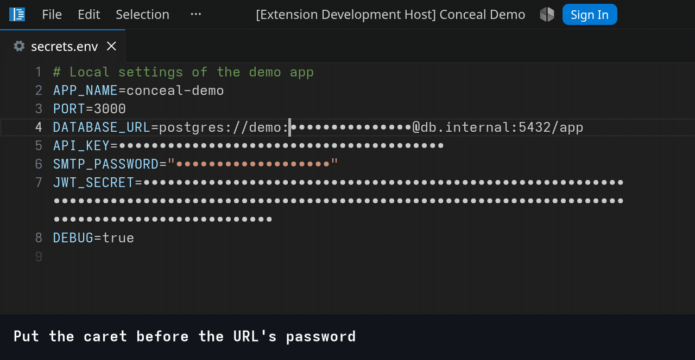
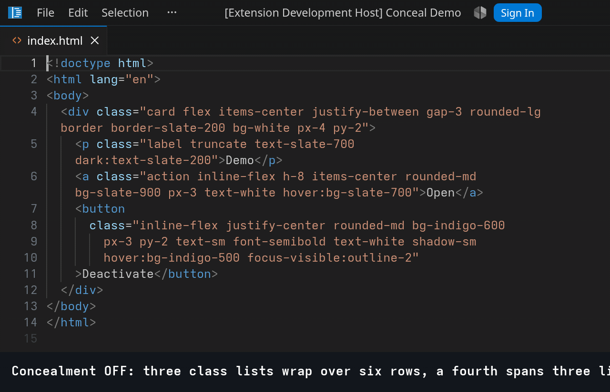
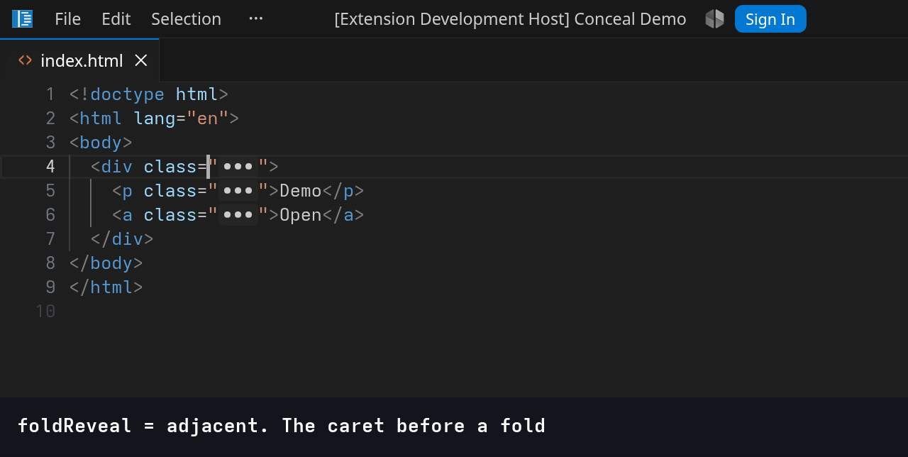
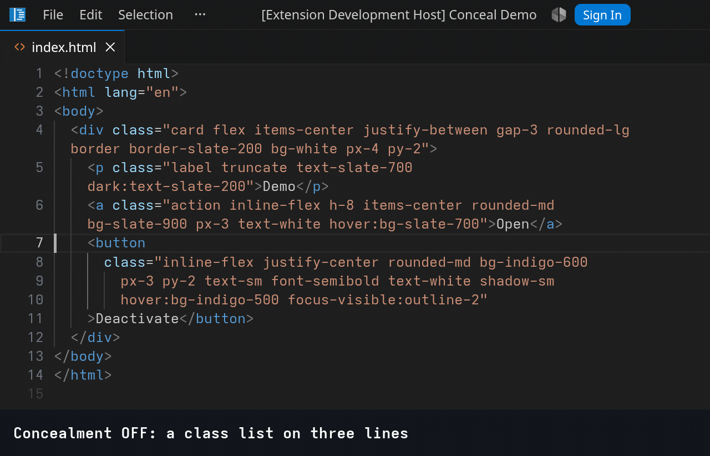
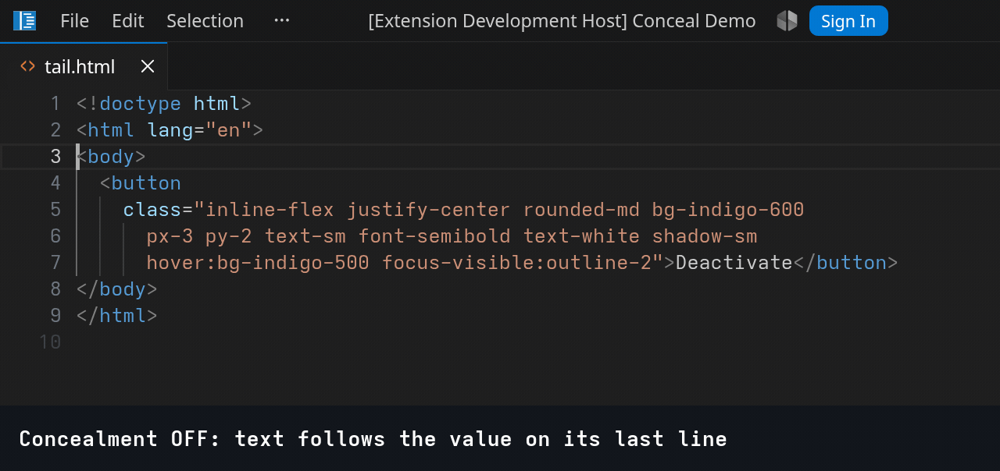

# Conceal Demo

A showcase of the VS Code **conceal decoration options**: the proposed `concealedText` decoration option that
takes a run of text out of what the editor draws while the file keeps every character. It answers
[microsoft/vscode#171074](https://github.com/microsoft/vscode/issues/171074) and lives in a fork,
branch `concealed-text-1.135`; on a stock build the extension conceals nothing.

One folder per case under [src/cases](src/cases), each hardcoded and readable top to bottom, with
its example file under [examples](examples) and the recordings beside it. Ranges are found with
regular expressions because this is a demo; a real extension asks its language's parser.

```bash
npm install
CONCEAL_DEMO_FORK=/path/to/vscode-fork ./scripts/dev.sh   # opens examples/ in the fork
```

`Conceal Demo: Toggle Concealment` flips `editor.conceal.enabled`, the editor's own switch, which
is how every recording shows what is really in the file.

## 1 — Tags

Shows basic replacement capabilities. Core functionality of proposal.

[src/cases/01-tags/tags.ts](src/cases/01-tags/tags.ts) · [examples/01-tags/tags.md](examples/01-tags/tags.md)

Replaces `#done` with one-symbol and `#bug` with multicharacter glyphs. "Tags to emoji" case is chosen as the most recognizable one. So specific LateX, or F# lamda syntax won't scare people. Replacement are really could be anything. See below to "Other Examples" section.

**Elsewhere:**:
- Vim's `conceal` with `cchar` (`:help conceal`)
- Emacs `prettify-symbols-mode`
- Obsidian Live Preview drawing tags as pills.

| The editor does | The extension does |
| --- | --- |
| hides the range and draws the replacement in its place | finds the ranges and picks the glyph |
| a caret stop on each side: one press or one word jump crosses it, ↑ and ↓ land on its nearest end | styles the replacement: colour, background, radius |
| Backspace, Delete and word delete take the whole tag, in one undo step | re-applies on every edit, so a tag that stops matching stops being concealed |
| selection, copy and Ctrl + F see the real text | - |

**Prior art.** Two extensions do this with a decoration and a setting named `adjustCursorMovement`,
which re-implements caret motion inside the extension. Their trackers show what that costs:

- [Prettify Symbols Mode](https://marketplace.visualstudio.com/items?itemName=siegebell.prettify-symbols-mode),
  23k installs, abandoned: [siegebell/vsc-prettify-symbols-mode#29](https://github.com/siegebell/vsc-prettify-symbols-mode/issues/29),
  the caret adjustment breaks on two-byte characters.
- [vsc-conceal](https://marketplace.visualstudio.com/items?itemName=BRBoer.vsc-conceal), its fork,
  abandoned: [rocq-community/vsc-conceal#4](https://github.com/rocq-community/vsc-conceal/issues/4),
  the caret drawn on the wrong side of the symbol, open since 2020.

**Conceal decoration shape for this example**
```ts
const doneDecoration = vscode.window.createTextEditorDecorationType({
  rangeBehavior: vscode.DecorationRangeBehavior.ClosedClosed,
  conceal: { replacement: { contentText: "✅" } },
});

const bugDecoration = vscode.window.createTextEditorDecorationType({
  rangeBehavior: vscode.DecorationRangeBehavior.ClosedClosed,
  conceal: {
    replacement: {
      contentText: "🐞 bug",
      color: new vscode.ThemeColor("charts.red"),
      backgroundColor: new vscode.ThemeColor("editorInlayHint.background"),
      borderRadius: "3px",
    },
  },
});

editor.setDecorations(doneDecoration, findRanges(editor.document, /#done\b/g));
```

**Concealment on and off**


**Write tag**


**Search finds the text under the glyph**


**What the clipboard carries**


**The caret around a glyph**


**A caret inside the range when concealment returns**


**Deleting a glyph**


**Two carets, two glyphs**


**The caret up and down through glyph lines**


## 4 — Mask

[src/cases/04-mask/mask.ts](src/cases/04-mask/mask.ts) · [examples/04-mask/secrets.env](examples/04-mask/secrets.env)

Secrets in an `.env` file drawn as dots, one per character, and edited under the mask: a character
typed at a secret's edge joins it masked, Backspace takes one hidden character, and the value is
shown only when concealment is switched off.

**Solvable today, mostly.** This is the one case a decoration already covers, so the disclaimer
comes first. [Camouflage](https://marketplace.visualstudio.com/items?itemName=zeybek.camouflage)
(2.8k installs, released 2026-06) squeezes the value to nothing with `letterSpacing: -1000em` and
draws `****` after it; [dotenv](https://marketplace.visualstudio.com/items?itemName=dotenv.dotenv-vscode)
(297k, last release 2023-11) does the same with `opacity: 0`;
[Cloak](https://marketplace.visualstudio.com/items?itemName=johnpapa.vscode-cloak) (62k) rewrites the
colour theme so values paint transparent. All three keep the text selectable and copyable, and so
does concealment. What the trick cannot give is the edit surface: the caret walks through the
invisible characters, drawn in the wrong place, and Backspace eats them blind, so Camouflage edits
a secret in an input box instead ([camouflage#14](https://github.com/zeybek/camouflage/issues/14));
and a secret longer than the wrap column wraps where its hidden characters would have been. Both
are in the last recording below, on this file, against Camouflage 1.4.0 with its defaults.

**What concealment changes for a mask**

- **A password field in the editor.** `preserveWidth` draws the dots at the value's width, wrapped
  rows included; `revealOnEdit: false` keeps a typed or deleted character under the mask;
  `deletionPolicy: "passthrough"` makes Backspace take one character, and one dot with it.
- **The caret crosses a mask in one press** and cannot rest inside it.
- **One switch.** `editor.conceal.enabled`, and the diff editor shows secrets unless
  `editor.conceal.inDiffEditor` is on: the editor's setting, not each extension's.

| The editor does | The extension does |
| --- | --- |
| hides the value and draws the dots at its width | finds the secrets: keys named `…SECRET`, `…PASSWORD`, `…KEY`, `…TOKEN`, and the password inside a URL |
| keeps the caret out: one press crosses a mask | gives every range its run of dots |
| Backspace and Delete take one hidden character, word delete a hidden word, nothing is shown | re-applies on every edit |
| keeps copy, search and undo on the real text | |

```ts
const maskDecoration = vscode.window.createTextEditorDecorationType({
  rangeBehavior: vscode.DecorationRangeBehavior.OpenOpen,
  conceal: {
    replacement: { contentText: "•" },
    preserveWidth: true,
    deletionPolicy: "passthrough",
    revealOnEdit: false,
  },
});

editor.setDecorations(maskDecoration, secrets.map((range) => ({
  range,
  renderOptions: { conceal: { replacement: { contentText: "•".repeat(length(range)) } } },
})));
```

**Concealment on and off**



**A secret edited under the mask**



**The caret across a mask**



**The same file with Camouflage**


## 7 — Fold

[src/cases/07-fold/fold.ts](src/cases/07-fold/fold.ts) · [examples/07-fold/index.html](examples/07-fold/index.html)

Long `class` attributes folded to a bold `•••` chip, and a value written over three lines folded
to one row. A fold opens when the caret reaches it and closes when the caret leaves; the
setting `conceal-demo.foldReveal` picks whether any key opens it or a mouse click only.

**Elsewhere:** JetBrains folds inside a line with placeholder text. VS Code folds whole lines only:
[microsoft/vscode#50840](https://github.com/microsoft/vscode/issues/50840) asks for folding inside
a line, 171 👍, open since 2018, and the folding owner answered three times that it needs the editor
core and cannot come from an extension. [#3352](https://github.com/microsoft/vscode/issues/3352),
310 👍, asks for the closing brace on the same line, a special case of it.

**Extensions today:** [Inline Fold](https://marketplace.visualstudio.com/items?itemName=moalamri.inline-fold),
305k installs, and [Tailwind Fold](https://marketplace.visualstudio.com/items?itemName=stivo.tailwind-fold),
337k, hide the characters with a CSS trick and draw `…`. Both are unmaintained: Inline Fold's author
lost the publisher account and declared it dead in 2024 ([discussion #132](https://github.com/moalamri/vscode-inline-fold/discussions/132),
[#137](https://github.com/moalamri/vscode-inline-fold/issues/137)); Tailwind Fold has had no release
since 2024-06, with 40 issues open. So there is no side-by-side recording for this case.

**What concealment changes for a fold**

- **A folded row is as short as it looks.** Hidden characters still take their room under word
  wrap, and a value written over several lines keeps its empty rows; the maintainer of Inline Fold
  explains why he cannot fix that in [discussion #69](https://github.com/moalamri/vscode-inline-fold/discussions/69),
  and [tailwind-fold#6](https://github.com/stivoat/tailwind-fold/issues/6) shows the hole.
  Concealed, the editor lays the line out from what it draws, and `line: true` takes the extra
  rows out.
- **The caret cannot fall into hidden text.** With the trick, arrow keys walk through invisible
  characters and Backspace eats them, so the extensions must unfold whatever the caret or a
  selection touches, and that fights the selection ([inline-fold#119](https://github.com/moalamri/vscode-inline-fold/issues/119),
  reproduced, never fixed). Concealed, a key jumps over the fold and a delete takes it whole, so
  the extension picks when a fold opens: when the caret reaches it, on a click, or never.
- **One switch for all of it.** `editor.conceal.enabled` and `editor.conceal.inDiffEditor` belong
  to the editor, not to each extension ([inline-fold#136](https://github.com/moalamri/vscode-inline-fold/issues/136),
  [tailwind-fold#40](https://github.com/stivoat/tailwind-fold/issues/40)).

Opening a fold with a click works either way: a click on the drawn text puts the caret at the
fold's edge, which the extension sees, just as a click on the extensions' `…` does.

| The editor does | The extension does |
| --- | --- |
| hides the value and draws the text given for that range | finds the values and picks the ones long enough to fold |
| leaves the rows of a multi-line value out of the view, the numbering kept | decides what opens a fold: any arrival, or a click |
| keeps the caret out of the fold: one press crosses it, one delete takes it | re-applies on every edit and caret move |
| keeps copy, search and undo on the real text | |

```ts
const foldDecoration = vscode.window.createTextEditorDecorationType({
  rangeBehavior: vscode.DecorationRangeBehavior.ClosedClosed,
  conceal: {
    replacement: {
      contentText: "•••",
      fontWeight: "bold",
      color: new vscode.ThemeColor("editor.foreground"),
      backgroundColor: new vscode.ThemeColor("editorInlayHint.background"),
      borderRadius: "3px",
      padding: "0 3px",
    },
  },
});
const hiddenLineDecoration = vscode.window.createTextEditorDecorationType({
  conceal: { line: true },
});
const closingDecoration = vscode.window.createTextEditorDecorationType({
  rangeBehavior: vscode.DecorationRangeBehavior.ClosedClosed,
  conceal: { replacement: { contentText: '"' } },
});

// A value on several lines: its first line is concealed and drawn as `•••`, the closing quote
// from its last line is drawn after it as a second replacement, and the lines below vanish.
editor.setDecorations(foldDecoration, [firstLinePart]);
editor.setDecorations(closingDecoration, [{ range: lastCharOfFirstLine, renderOptions: { conceal: { replacement: { contentText: '"' } } } }]);
editor.setDecorations(hiddenLineDecoration, linesBelow);
```

**Long class lists folded, one row each**



**A fold opens when the caret reaches it**



**A value on three lines, one row**



**A click opens a fold**

<!-- Filmed by hand: ./scripts/record.sh 0704, then take this line out of the comment.

-->

**Text after a multi-line value: the limit of the emulation**



Recorded as a known limit, not a feature. This is not folding: it is folding emulated with
concealment, and a concealed range stays within one line. A value that ends part-way through a
later line leaves its trailing text on a hidden row, so the extension draws that text on the first
row instead. Drawn text is one colour, has no caret positions of its own, and a click on it lands on
the fold's edge. Lifting this means laying one row out from several lines, a change to the editor's
view model far beyond a decoration option, so it is left out of the concealment proposal's scope.

## Recording

The GIFs are played by the extension's own recorder and photographed by
[scripts/record.sh](scripts/record.sh) on WSLg; its header lists the requirements.

```bash
CONCEAL_DEMO_FORK=/path/to/vscode-fork CONCEAL_DEMO_WINSHOT=/path/to/winshot.ps1 \
  ./scripts/record.sh 07         # case 7; `0701 0703` picks scenes
```

A step marked `manual` in [examples/scenes.json](examples/scenes.json) is filmed by hand: the
recorder sets the scene up and sizes the window, the Windows ffmpeg films the workbench rectangle
with the pointer in it until Enter is pressed in the terminal, and the clip gets its caption like
any frame. That is how the mouse scenes are made, since nothing in the pipeline can move the mouse.

A scene that shows another extension beside the API needs it installed: the pinned ones in
[scripts/compare-extensions.txt](scripts/compare-extensions.txt) go into the recording profile unless
`CONCEAL_DEMO_NO_COMPARE=1` is set, and every scene states with a setting whether that extension is on.
