# VS Code Conceal Demo

A showcase of the VS Code **conceal decoration options**.

- [VS Code Conceal Demo](#vs-code-conceal-demo)
   - [1 — Tags](#1--tags)
   - [2 — Dynamic replacement](#2--dynamic-replacement)
   - [3 — Invisible metadata](#3--invisible-metadata)
   - [4 — Hide Markdown markup](#4--hide-markdown-markup)
   - [5 — Gallery](#5--gallery)
   - [Implementation](#implementation)
   - [Run](#run)
   - [Links](#links)


## 1 — Tags

**Shows:**
- text -> glyph replacement
- cursor movement
- `deletionPolicy: atomic` behavior

**Paths:**
- Logic: [src/cases/01-tags/tags.ts](src/cases/01-tags/tags.ts)
- Example: [examples/01-tags/tags.md](examples/01-tags/tags.md)

**What it does:**
Replaces `#done` with a one-symbol glyph and `#bug` with a multi-character one. The "tags to emoji" case was chosen as the most recognizable one, so LaTeX- or F#-specific syntax won't scare people off. The replacement could really be anything: see the "Gallery" section below.

**Conceal decoration shape for this example**
```ts
const doneDecoration = vscode.window.createTextEditorDecorationType({
  rangeBehavior: vscode.DecorationRangeBehavior.ClosedClosed,
  conceal: { replacement: { contentText: "✅" } },
});

const bugDecoration = vscode.window.createTextEditorDecorationType({
  rangeBehavior: vscode.DecorationRangeBehavior.ClosedClosed,
  conceal: {
    replacement: {
      contentText: "🐞 bug",
      color: new vscode.ThemeColor("charts.red"),
      backgroundColor: new vscode.ThemeColor("editorInlayHint.background"),
      borderRadius: "3px",
    },
  },
});

editor.setDecorations(doneDecoration, findRanges(editor.document, /#done\b/g));
```

**1 — Concealment on and off**

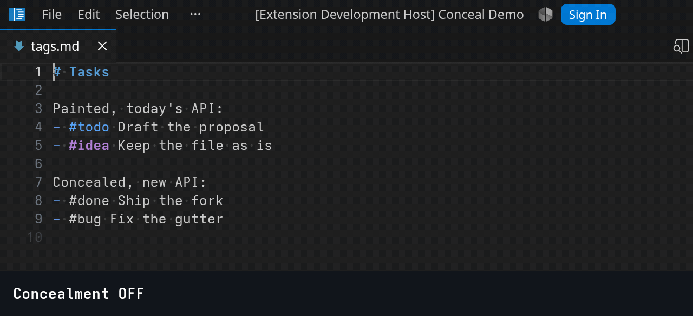

**2 — Search finds the text under the glyph**


**3 — What the clipboard carries**


**4 — The cursor around a glyph**

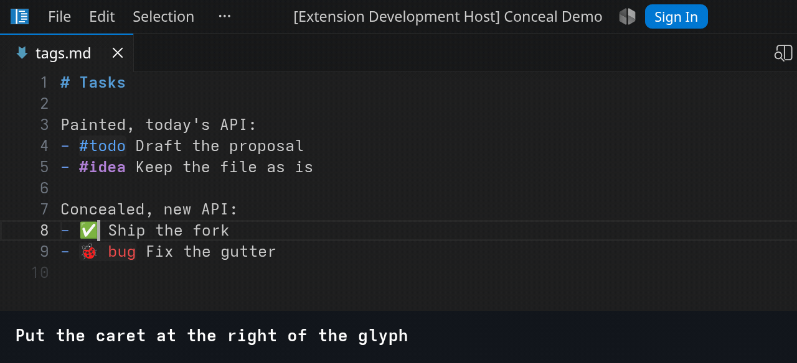

**5 — A cursor inside the range when concealment returns**

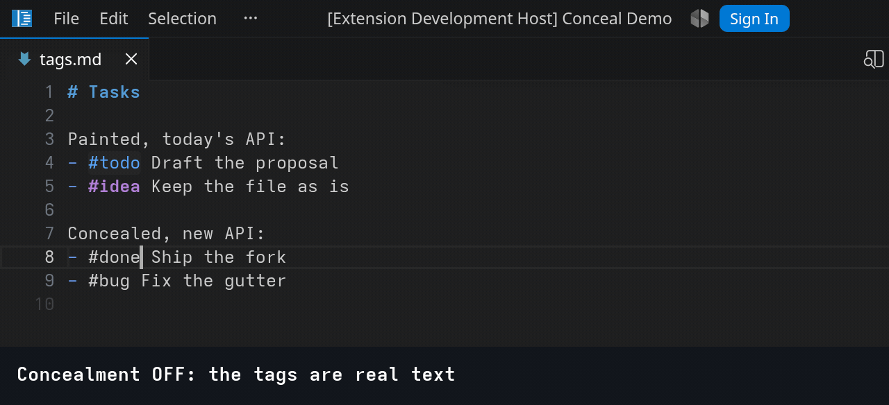

**6 — Deleting a glyph (atomic)**

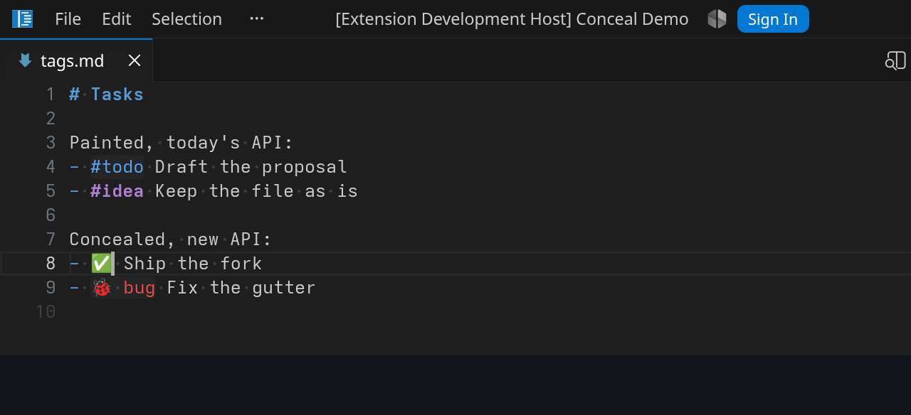

**7 — Two cursors, two glyphs**


**8 — The cursor up and down through glyph lines**


**9 — Writing a tag**

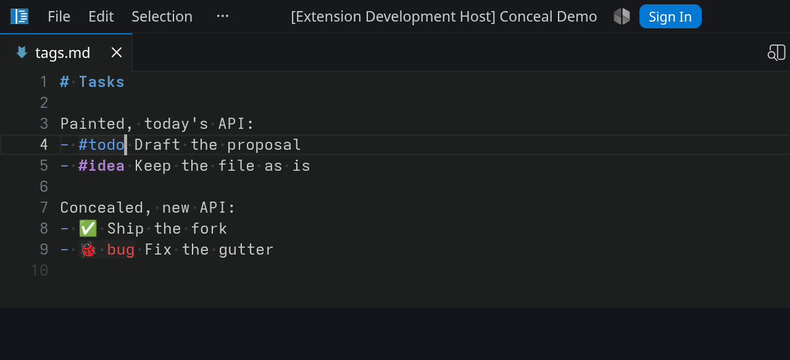


## 2 — Dynamic replacement

**Shows:**
- dynamic text replacement
- `deletionPolicy: reveal` behavior

**Paths:**
- Logic: [src/cases/02-i18n/i18n.ts](src/cases/02-i18n/i18n.ts)
- Example: [examples/02-i18n/checkout.ts](examples/02-i18n/checkout.ts), [examples/02-i18n/comments.ts](examples/02-i18n/comments.ts)

**What it does:**
Replaces one text with another:
- TS code with static values underneath replaced with said values.
- Comments in Spanish replaced with an English translation

Imitated with a hardcoded JSON config, but in a real extension values can arrive from anywhere: a translation service, a language server, a bibliography, etc.

Here is where `deletionPolicy: reveal` works great. Often you don't want to delete the whole replacement at once as in the tags example. You want to edit the real text underneath. This policy automatically reveals the real text on Backspace/Delete against a concealed range.

**Conceal decoration shape for this example**
```ts
// One type for every string drawn: only the replacement varies, and it travels with the range.
const translationDecoration = vscode.window.createTextEditorDecorationType({
  rangeBehavior: vscode.DecorationRangeBehavior.ClosedClosed,
  conceal: { deletionPolicy: "reveal" },
});

editor.setDecorations(translationDecoration, matches.map((match) => ({
  range: match.range,
  renderOptions: { conceal: { replacement: { contentText: catalogue[match.text] } } },
  hoverMessage: `\`${match.text}\``,
})));
```

**1 — Concealment on and off**

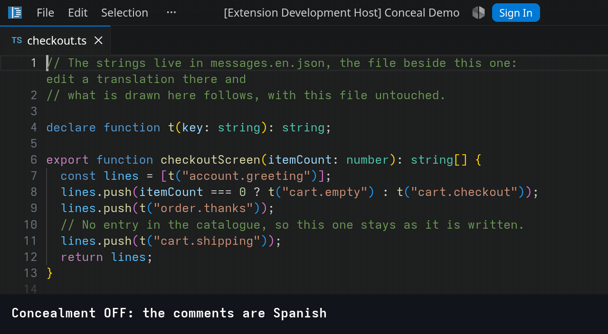

**2 — Wrap works on what is visible**

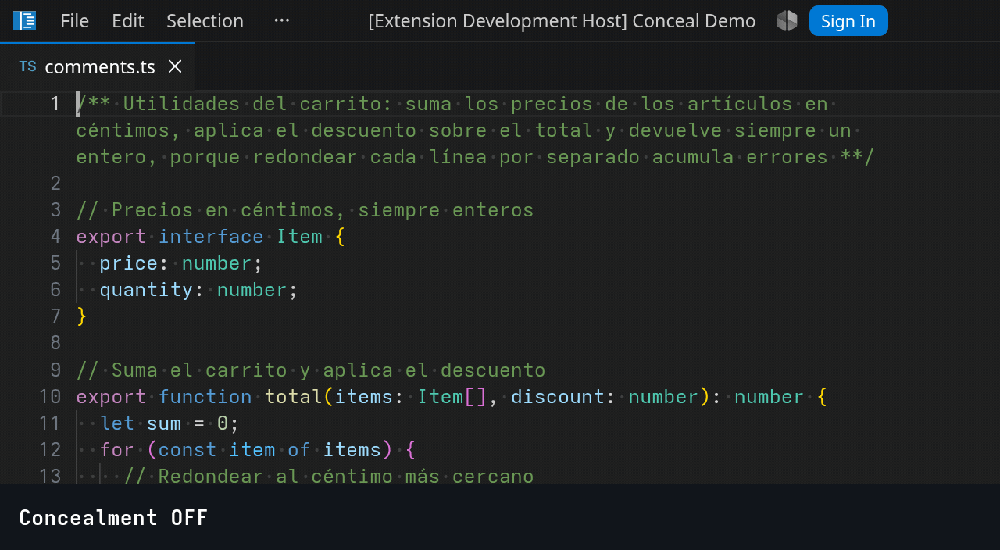

**3 — A delete key reveals the text**

The first `Backspace` only reveals the real text. The second actually deletes it.

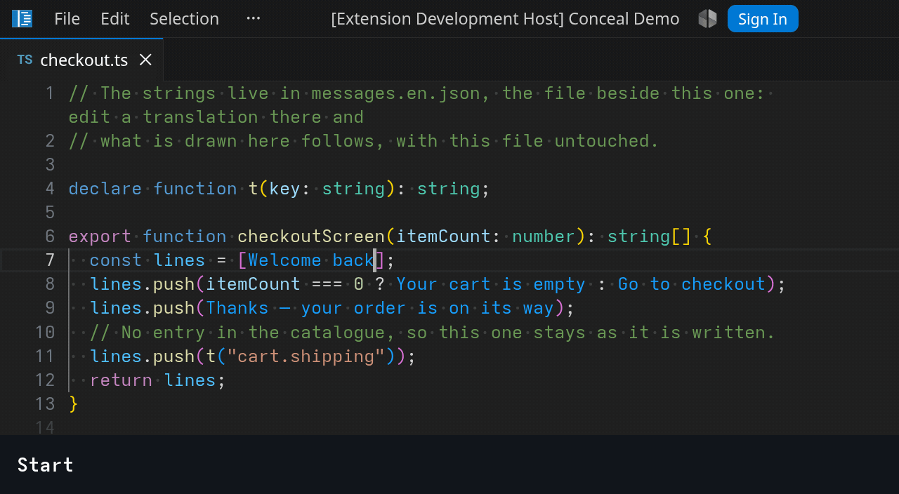

**4 — A key edited under the drawn string**

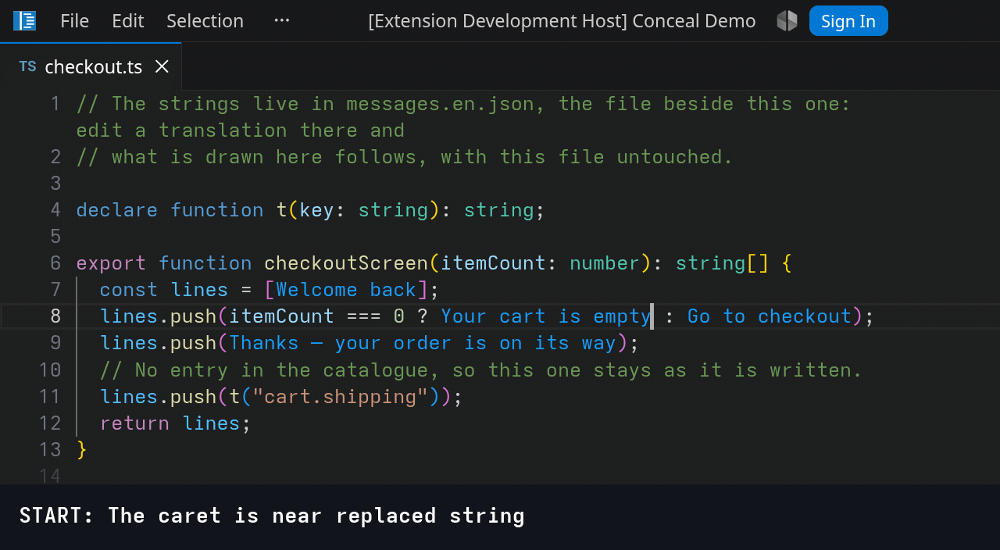

## 3 — Invisible metadata

**Shows:**
- concealment with nothing drawn in its place
- `anchor: lineEnd`
- `deletionPolicy: protect` behavior

**Paths:**
- Logic: [src/cases/03-invisible-metadata/metadata.ts](src/cases/03-invisible-metadata/metadata.ts)
- Example: [examples/03-invisible-metadata/notes.md](examples/03-invisible-metadata/notes.md)

**What it does:**
Hides machine metadata: note IDs in this example.

- `my note ^a3f9c1` -> `my note`
- `this is my link [[Note#^id]]` -> `this is my link [[Note]]`

**Conceal decoration shape for this example**
```ts
const idDecoration = vscode.window.createTextEditorDecorationType({
  conceal: { anchor: "lineEnd", deletionPolicy: "protect" },
});
```

**1 — Block ids on and off**

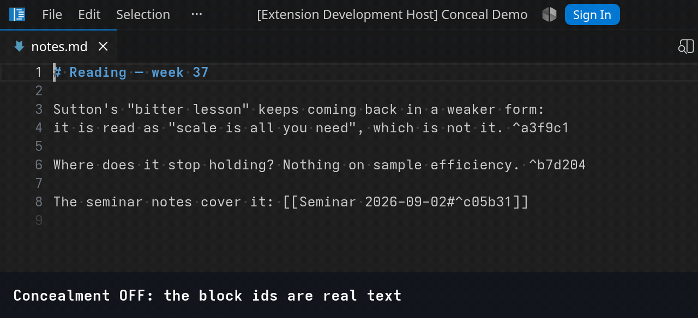

**2 — The cursor crosses an id**

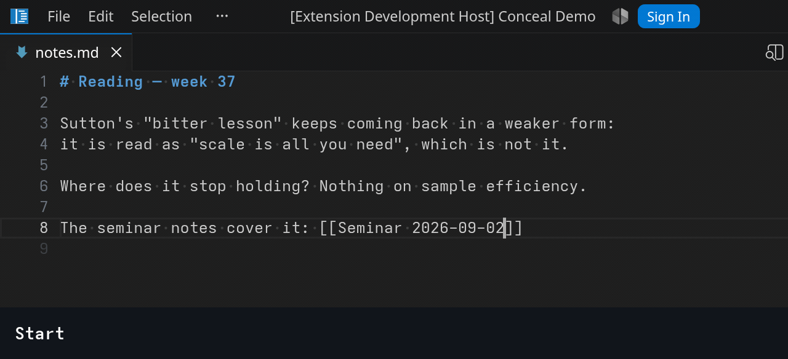

**3 — Backspace skips an id**


**4 — Delete skips an id**

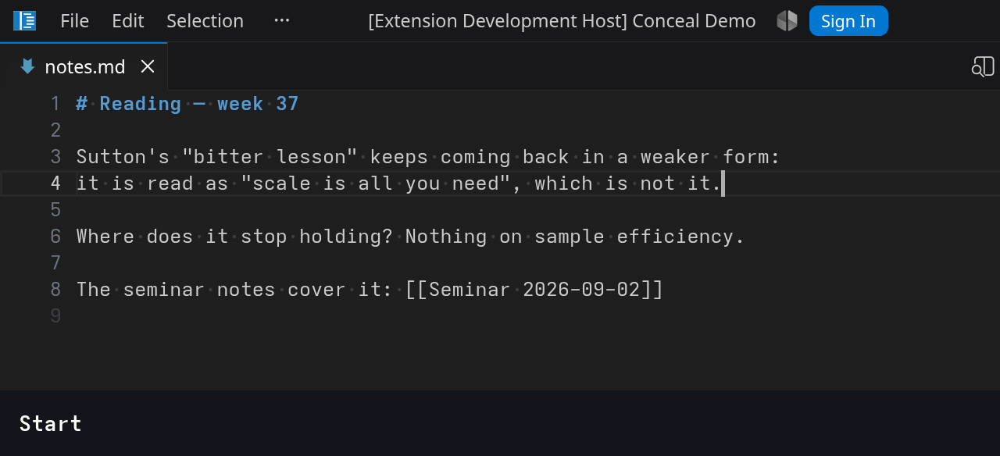

**5 — A word typed at the line end**

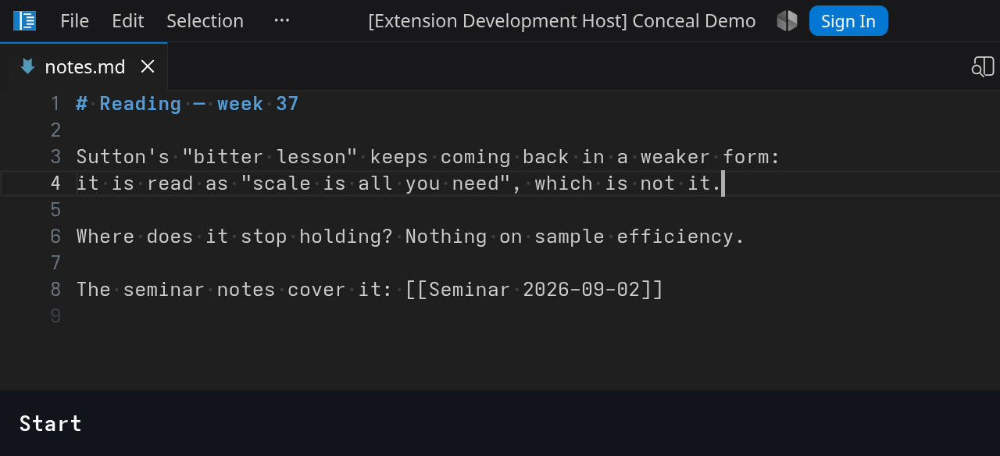

**6 — Enter at the line end**


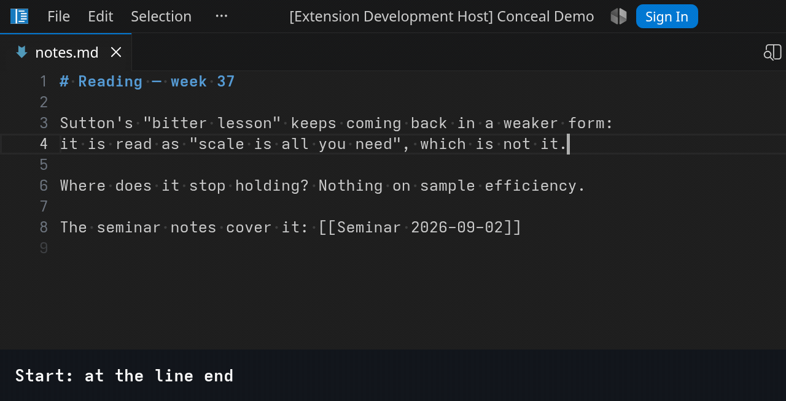

**7 — What the clipboard carries**

The ID is copied only if the next line is also selected.

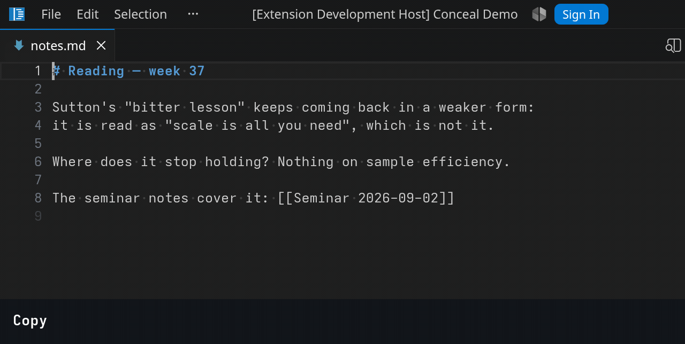

**8 — What the clipboard carries around a hidden ref**

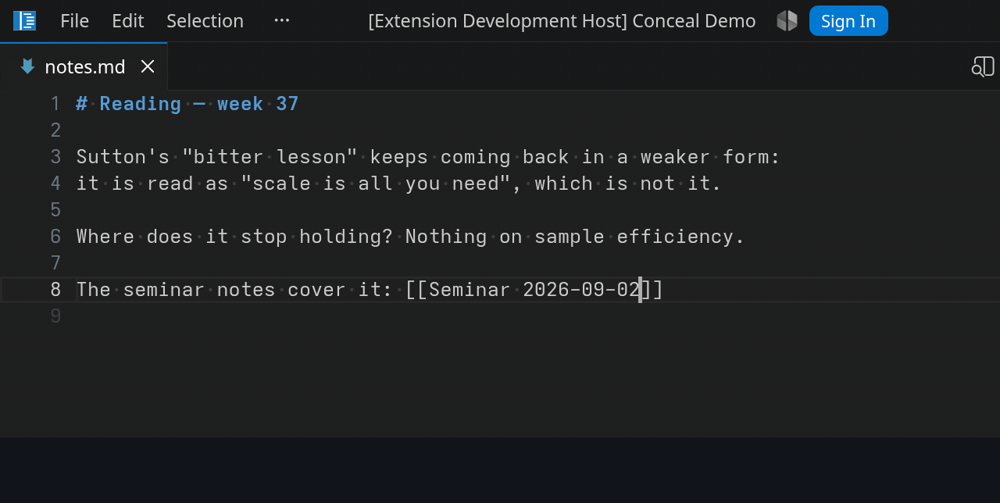

## 4 — Hide Markdown markup

**Shows:**
- concealed markup
- `anchor: after` on the opening marker, `anchor: before` on the closing one
- `deletionPolicy: protect` behavior
- a link drawn as its text: per-range `replacement`, `deletionPolicy: reveal`

**Paths:**
- Logic: [src/cases/04-markup/markup.ts](src/cases/04-markup/markup.ts)
- Example: [examples/04-markup/emphasis.md](examples/04-markup/emphasis.md)

**What it does:**
- Hides Markdown emphasis: `**bold**`, `_italic_` and `` `code` `` read as the styled word alone.
- `[My link example](https://example.com)` -> [My link example](https://example.com)

Opens the gate to live Markdown editing as in [Obsidian Live Preview](https://obsidian.md/help/edit-and-read).

Related to the VS Code feature request: [#286296 Support decorations that hide characters](https://github.com/microsoft/vscode/issues/286296).


**Conceal decoration shape for this example**
```ts
const openingDecoration = vscode.window.createTextEditorDecorationType({
  conceal: { anchor: "after", deletionPolicy: "protect" },
});

const closingDecoration = vscode.window.createTextEditorDecorationType({
  conceal: { anchor: "before", deletionPolicy: "protect" },
});

const boldDecoration = vscode.window.createTextEditorDecorationType({ fontWeight: "bold" });

// A link is one range drawing its own text
const linkDecoration = vscode.window.createTextEditorDecorationType({
  conceal: { deletionPolicy: "reveal" },
});

// Every pair as its opener, text and closer, from one expression per kind: /\*\*([^*]+)\*\*/g
const found = pairs(editor.document);
editor.setDecorations(openingDecoration, found.map((pair) => pair.opener));
editor.setDecorations(closingDecoration, found.map((pair) => pair.closer));
editor.setDecorations(boldDecoration, found.filter((pair) => pair.kind === "bold").map((pair) => pair.text));

// Every `[text](url)`, drawn as its text.
editor.setDecorations(linkDecoration, links(editor.document).map(({ range, text, url }) => ({
  range,
  renderOptions: { conceal: { replacement: { contentText: text, color: new vscode.ThemeColor("textLink.foreground"), textDecoration: "underline" } } },
  hoverMessage: url,
})));
```

**1 — Markers on and off**

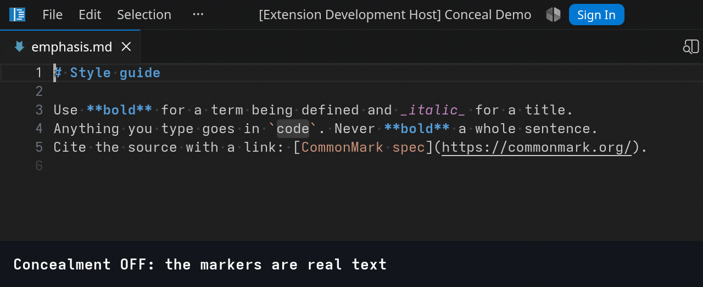

**2 — A hidden marker costs no keypress**

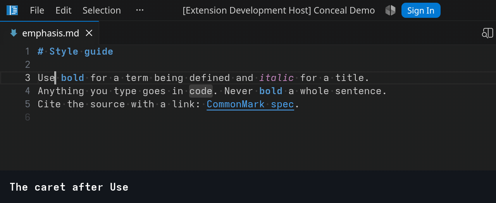

**3 — Typing at either visible edge stays inside the pair**

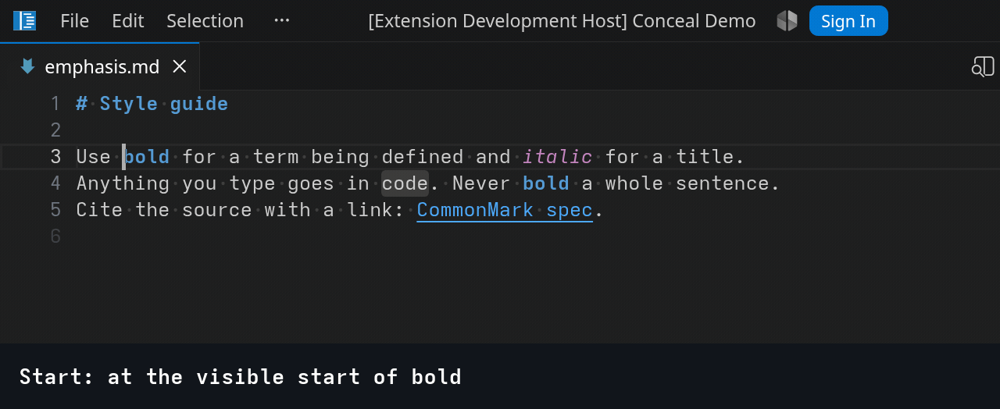

**4 — A space at the visible end lands outside the pair**

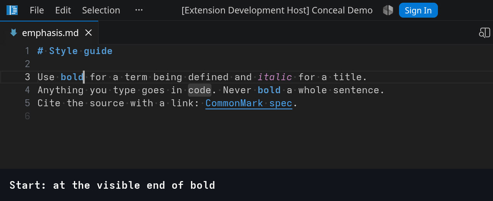

**5 — Enter at the visible end leaves the pair whole**

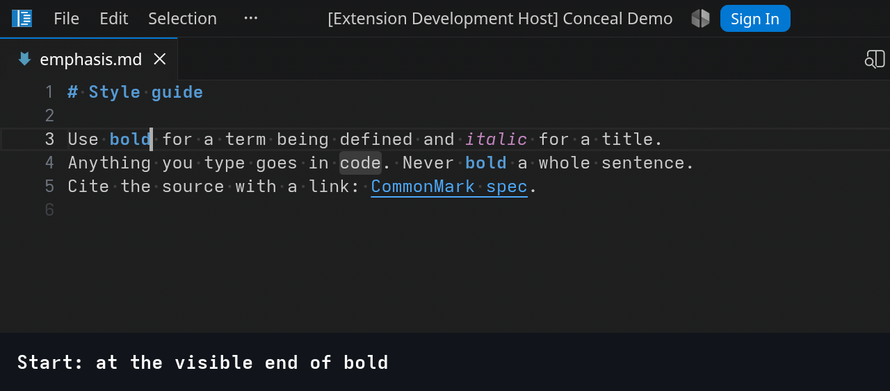

**6 — No delete key reaches a marker**

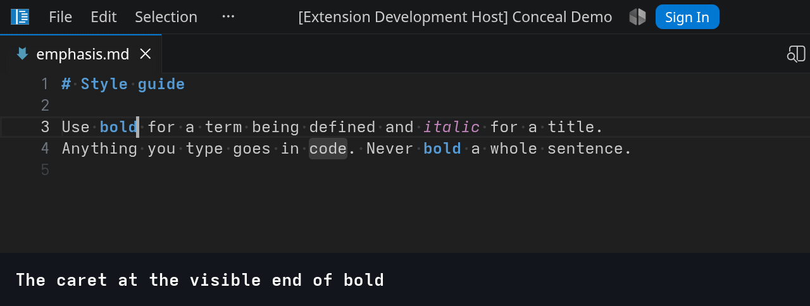

**7 — A marker without a partner shows itself**

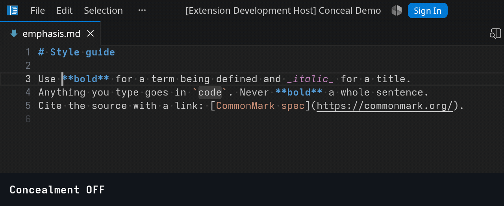

**8 — A link shows itself on Backspace and hides again**

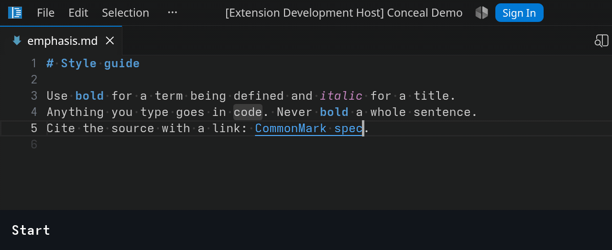

**9 — Delete takes exactly what the selection covers**


## 5 — Gallery

Small examples inspired by other extensions, editors and open VS Code issues.

**Shows:**
- JSON keys: `"name":` as `name:` — `anchor: after` / `anchor: before` on the quotes, `deletionPolicy: protect`.
- F# lambda: `fun` as λ, `->` as →
- TS arrow: `=>` as one ⇒
- LaTeX macros: `\alpha` as α, from a table — `deletionPolicy: reveal`
- Tag rotation: `#todo` as 🟨, `#done` as ✅, a click on the glyph rewrites the tag
- Inline fold: a long `class` value as a `•••` chip, a click unfolds it and a chip at its start folds it again — `deletionPolicy: reveal`

**Paths:**
- Logic: [src/cases/05-gallery](src/cases/05-gallery) — [jsonKeys.ts](src/cases/05-gallery/jsonKeys.ts) · [fsharpLambda.ts](src/cases/05-gallery/fsharpLambda.ts) · [tsArrow.ts](src/cases/05-gallery/tsArrow.ts) · [latexMacros.ts](src/cases/05-gallery/latexMacros.ts) · [tagRotation.ts](src/cases/05-gallery/tagRotation.ts) · [fold.ts](src/cases/05-gallery/fold.ts)
- Example: [examples/05-gallery](examples/05-gallery) — [config.json](examples/05-gallery/config.json) · [lambda.fs](examples/05-gallery/lambda.fs) · [arrow.ts](examples/05-gallery/arrow.ts) · [formula.tex](examples/05-gallery/formula.tex) · [todo.md](examples/05-gallery/todo.md) · [card.html](examples/05-gallery/card.html)

**1 — JSON keys**

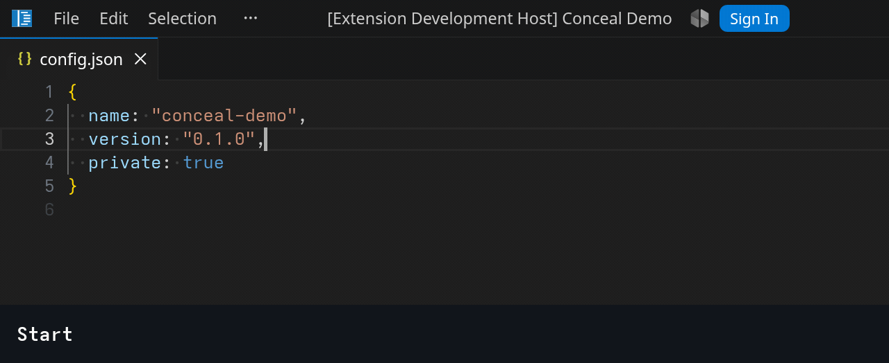

**2 — F# lambda**

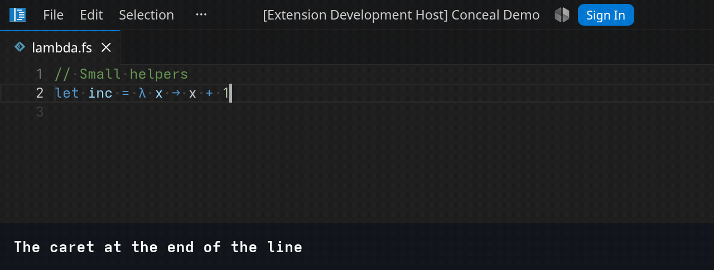

**3 — TS arrow**

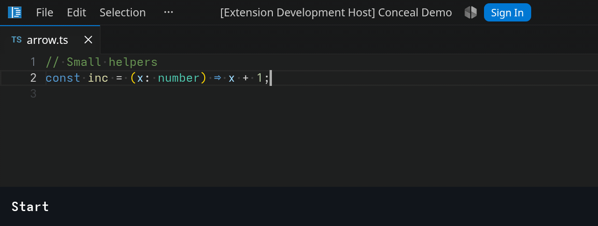

**4 — LaTeX macros**

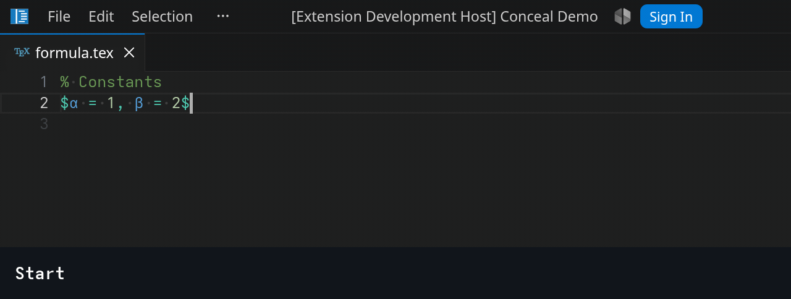

**5 — Tag rotation**

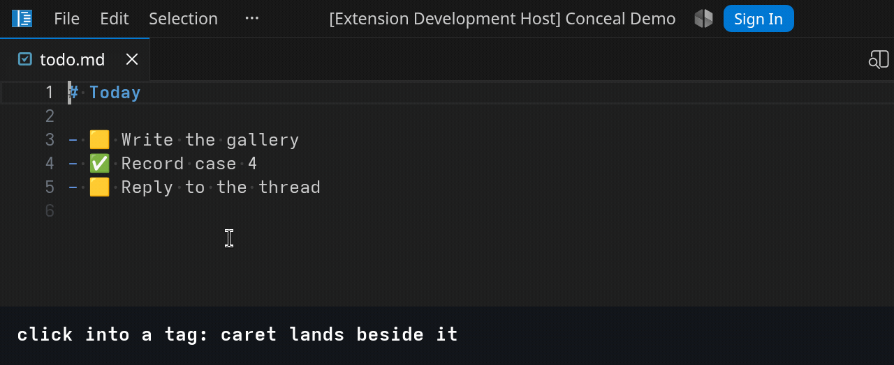

**6 — Inline fold**

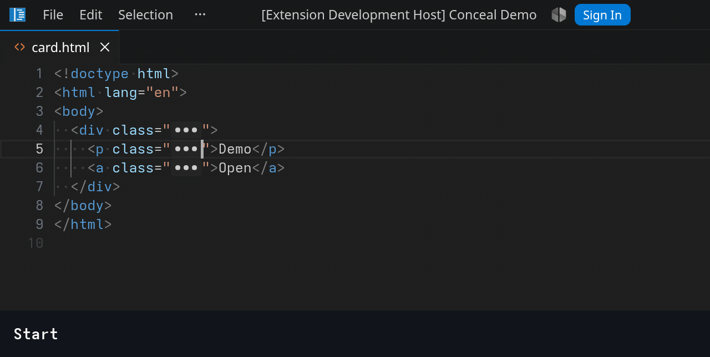

**7 — Inline fold, by click**

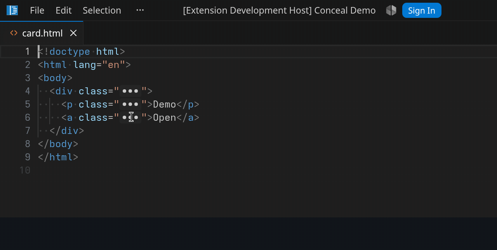


## Implementation

Each case lives in its own folder, `src/cases/<NN-name>/`. It only works on files in the matching `examples/<NN-name>` dir.

All parsing is done with regexp. Real extensions should use specialized parsers instead.


## Run

```bash
npm install
CONCEAL_DEMO_FORK=/path/to/vscode-fork ./scripts/dev.sh   # opens examples/ in the fork
```

ON/OFF concealment via command: `Conceal Demo: Toggle Concealment`.
<!-- grammar: no verb, missing article: "Toggle concealment on/off via the command: …" -->


## Links

1. Proposal: [Concealed text — a proposed VS Code API (v4) · GitHub](https://gist.github.com/heyzling/6235fd30bda7605199963e15f12142f5)
1. Implementation: [VS Code Fork concealed-text-1.135 branch](https://github.com/heyzling/vscode/tree/concealed-text-1.135)
1. 2023, motivating request, still open, Backlog, 60 👍: [#171074 Feature request: prettify symbols mode](https://github.com/microsoft/vscode/issues/171074)