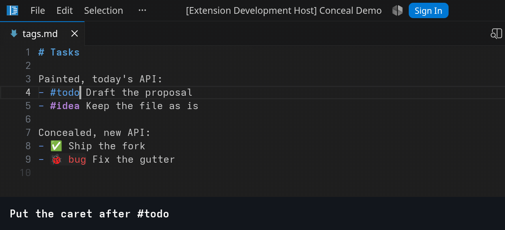
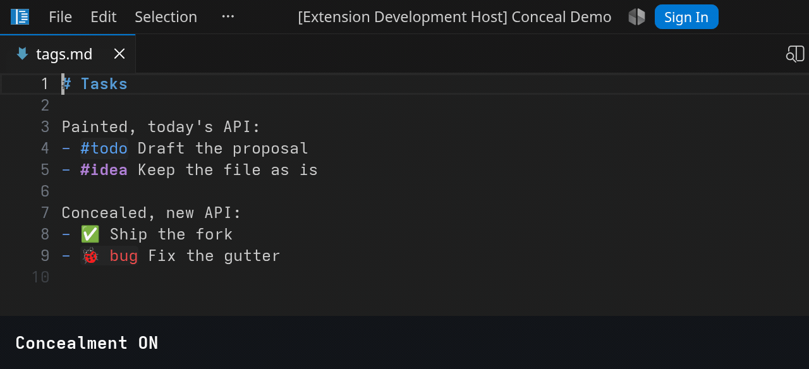
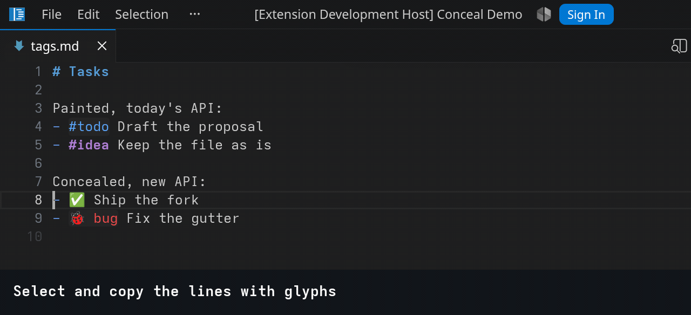
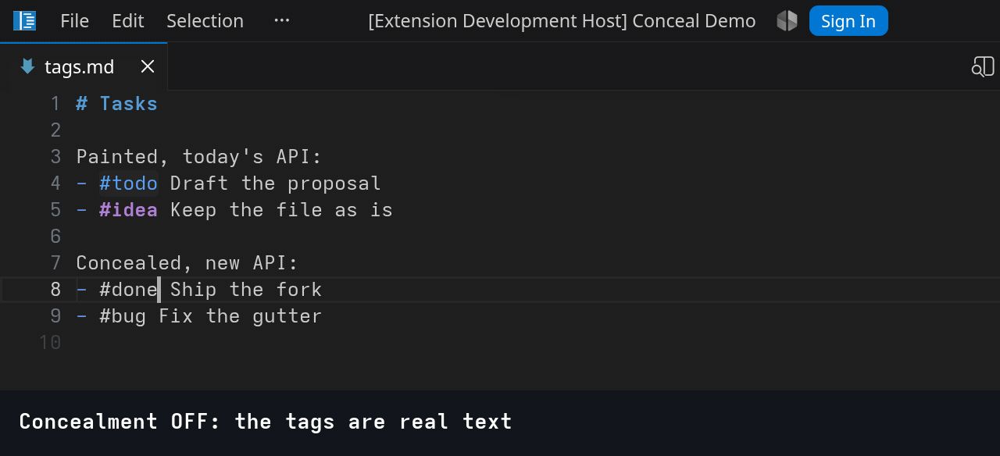
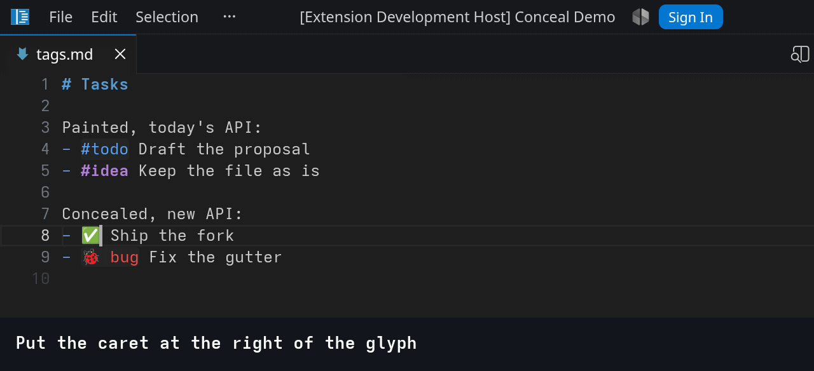
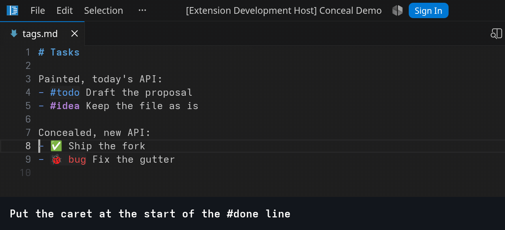
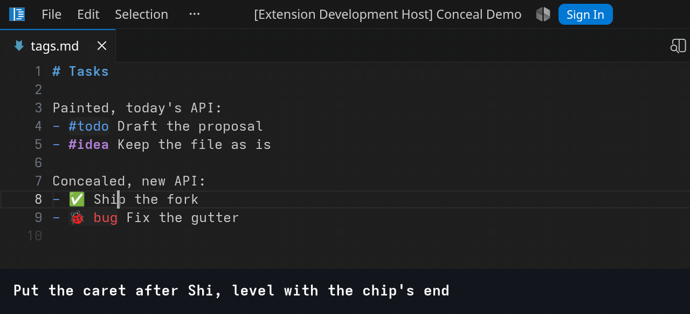

# Conceal Demo

A showcase of the VS Code **conceal decoration options**: the proposed `concealedText` decoration option that
takes a run of text out of what the editor draws while the file keeps every character. It answers
[microsoft/vscode#171074](https://github.com/microsoft/vscode/issues/171074) and lives in a fork,
branch `concealed-text-1.135`; on a stock build the extension conceals nothing.

One folder per case under [src/cases](src/cases), each hardcoded and readable top to bottom, with
its example file under [examples](examples) and the recordings beside it. Ranges are found with
regular expressions because this is a demo; a real extension asks its language's parser.

```bash
npm install
CONCEAL_DEMO_FORK=/path/to/vscode-fork ./scripts/dev.sh   # opens examples/ in the fork
```

`Conceal Demo: Toggle Concealment` flips `editor.conceal.enabled`, the editor's own switch, which
is how every recording shows what is really in the file.

## 1 — Tags

Shows basic replacement capabilities. Core functionality of proposal.

[src/cases/1-tags/tags.ts](src/cases/1-tags/tags.ts) · [examples/1-tags/tags.md](examples/1-tags/tags.md)

Replaces `#done` with one-symbol and `#bug` with multicharacter glyphs. "Tags to emoji" case is chosen as the most recognizable one. So specific LateX, or F# lamda syntax won't scare people. Replacement are really could be anything. See below to "Other Examples" section.

**Elsewhere:**:
- Vim's `conceal` with `cchar` (`:help conceal`)
- Emacs `prettify-symbols-mode`
- Obsidian Live Preview drawing tags as pills.

| The editor does | The extension does |
| --- | --- |
| hides the range and draws the replacement in its place | finds the ranges and picks the glyph |
| a caret stop on each side: one press or one word jump crosses it, ↑ and ↓ land on its nearest end | styles the replacement: colour, background, radius |
| Backspace, Delete and word delete take the whole tag, in one undo step | re-applies on every edit, so a tag that stops matching stops being concealed |
| selection, copy and Ctrl + F see the real text | - |

**Prior art.** Two extensions do this with a decoration and a setting named `adjustCursorMovement`,
which re-implements caret motion inside the extension. Their trackers show what that costs:

- [Prettify Symbols Mode](https://marketplace.visualstudio.com/items?itemName=siegebell.prettify-symbols-mode),
  23k installs, abandoned: [siegebell/vsc-prettify-symbols-mode#29](https://github.com/siegebell/vsc-prettify-symbols-mode/issues/29),
  the caret adjustment breaks on two-byte characters.
- [vsc-conceal](https://marketplace.visualstudio.com/items?itemName=BRBoer.vsc-conceal), its fork,
  abandoned: [rocq-community/vsc-conceal#4](https://github.com/rocq-community/vsc-conceal/issues/4),
  the caret drawn on the wrong side of the symbol, open since 2020.

**Conceal decoration shape for this example**
```ts
const doneDecoration = vscode.window.createTextEditorDecorationType({
  rangeBehavior: vscode.DecorationRangeBehavior.ClosedClosed,
  conceal: { replacement: { contentText: "✅" } },
});

const bugDecoration = vscode.window.createTextEditorDecorationType({
  rangeBehavior: vscode.DecorationRangeBehavior.ClosedClosed,
  conceal: {
    replacement: {
      contentText: "🐞 bug",
      color: new vscode.ThemeColor("charts.red"),
      backgroundColor: new vscode.ThemeColor("editorInlayHint.background"),
      borderRadius: "3px",
    },
  },
});

editor.setDecorations(doneDecoration, findRanges(editor.document, /#done\b/g));
```

**Concealment on and off**


**Write tag**




**Search finds the text under the glyph**



**What the clipboard carries**



**The caret around a glyph**


**A caret inside the range when concealment returns**



**Deleting a glyph**



**Two carets, two glyphs**



**The caret up and down through glyph lines**




## Recording

The GIFs are played by the extension's own recorder and photographed by
[scripts/record.sh](scripts/record.sh) on WSLg; its header lists the requirements.

```bash
CONCEAL_DEMO_FORK=/path/to/vscode-fork CONCEAL_DEMO_WINSHOT=/path/to/winshot.ps1 \
  ./scripts/record.sh 2          # case 2; `21 23` picks scenes
```

A step marked `manual` in [examples/scenes.json](examples/scenes.json) is filmed by hand: the
recorder sets the scene up and sizes the window, the Windows ffmpeg films the workbench rectangle
with the pointer in it until Enter is pressed in the terminal, and the clip gets its caption like
any frame. That is how the mouse scenes are made, since nothing in the pipeline can move the mouse.
