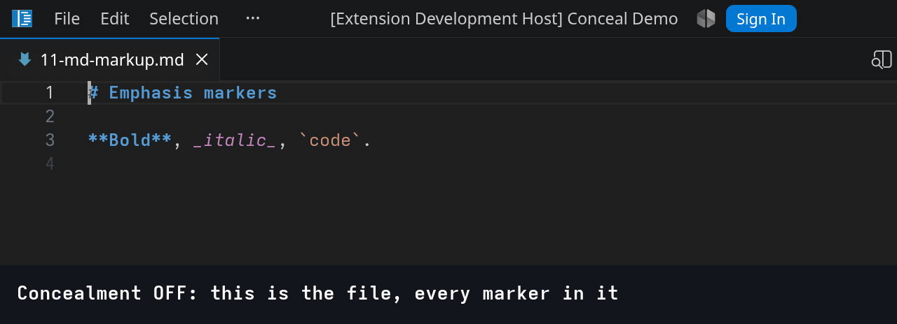
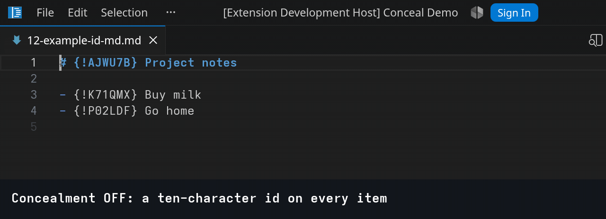
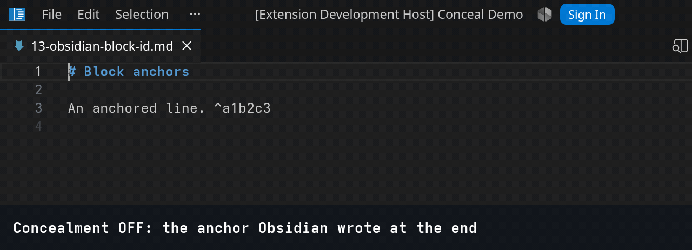
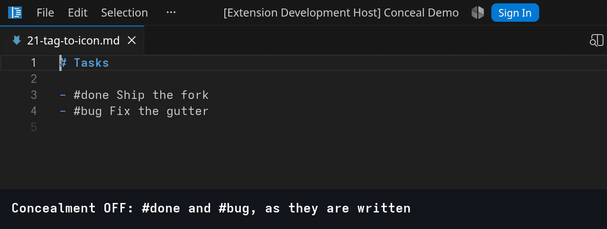
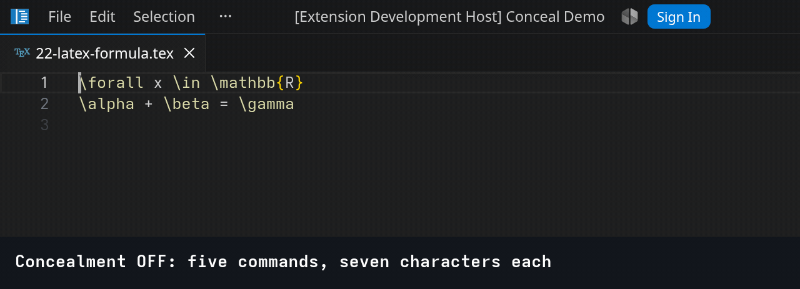
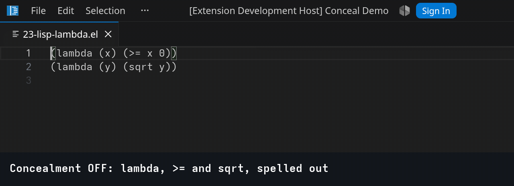
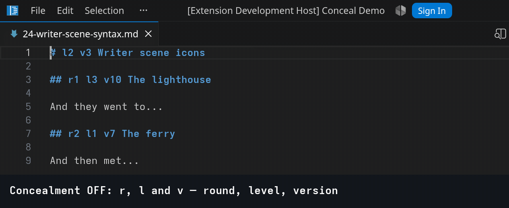
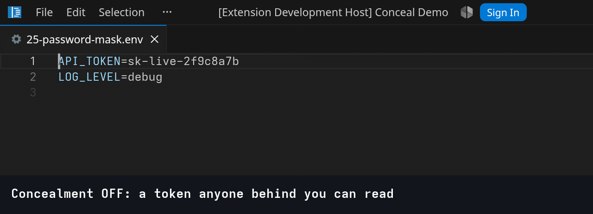
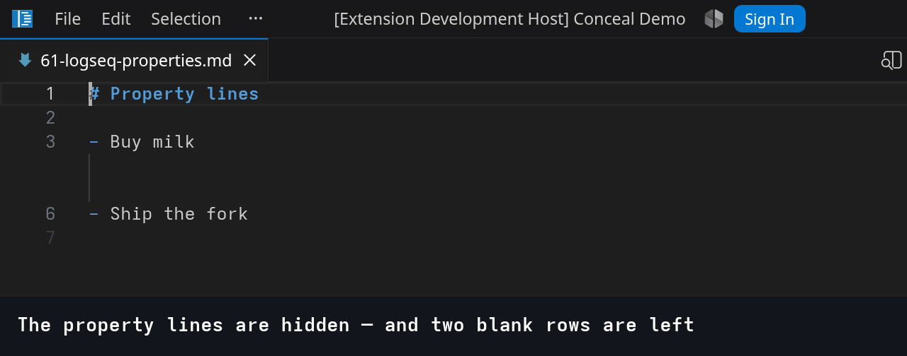
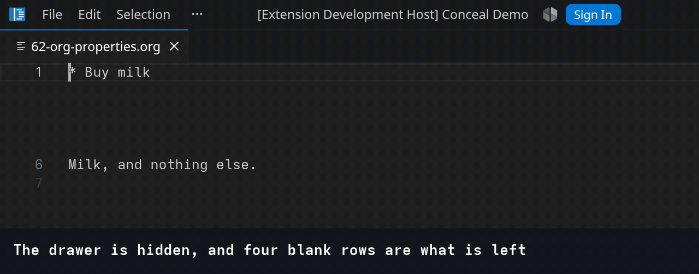

# Examples

One folder per group of the case survey. Open a file and the rules in
[default-rules.json](default-rules.json) fire on it; the section below links the file, names the
rule, and shows a recording of the behaviour.

Nothing in these files is rewritten. Every character you cannot see is still on disk — `git diff`
after a session of reading them is empty, and that is the property the whole approach exists to
keep.

The recordings are played by the editor itself: every caret move, copy and paste in them is the
editor's own behaviour, not an animation of it. Each one lives beside the file it demonstrates,
under the same name. Regenerate them with `../scripts/record.sh`; the scenes are data in
[scenes.json](scenes.json).

## 1 — Hide symbols

Text taken out of the view with nothing drawn in its place: the line simply closes up over it.
Markup a reader already understands, and identity markers a tool wrote for itself.

Every recording runs the same three beats — concealment off, so you can see what is in the file;
concealment on; then the line copied into a clean tab beside it. The last frame is the point of the
whole approach: what the clipboard carries is what is on disk, not what was on screen.

### 11 — Markdown emphasis markers

[1-hide/11-md-markup.md](1-hide/11-md-markup.md) · rules `hide-md-bold-open`/`-close`,
`hide-md-italic-open`/`-close`, `hide-md-tick-open`/`-close`

The oldest case there is — vim's markdown conceal, `org-hide-emphasis-markers` and the whole
Obsidian Live Preview family are all this one behaviour.

Two rules per delimiter, not one, and each carries a lookaround for its partner: `**` is concealed
only when a closing `**` follows it, and vice versa. A single `\*\*` rule looks equivalent and is
not — it hides every `**` independently, so deleting one half of a pair leaves the other concealed
and the line goes on drawing as `Bold, italic, code.` while the file underneath is broken markdown.
The damage never reaches the screen. With the pair rules the orphan stops matching and appears,
which is the behaviour a reader can trust.

All six set `cursorStop: "before"`, so the caret always rests to the *left* of a concealed
delimiter. Two things follow. The line keeps its gutter number even though it starts with concealed
text — view column 1 still maps to model column 1, where with the default `"after"` it would map
past the hidden `**` and the editor would stop numbering the row. And typing at the end of an
emphasised word extends it: the caret sits inside the run, before the closing delimiter, so
`Bold` + `er` is `**Bolder**` rather than `**Bold**er`. The cost is that Backspace never reaches a
delimiter — the caret is always on its left, so Backspace takes the ordinary character before it
and Delete is the key that takes the marker. Which key destroys what is decided by `cursorStop`,
per rule, and there is no setting that makes both directions safe.

### 12 — A record id

[1-hide/12-example-id-md.md](1-hide/12-example-id-md.md) · rule `hide-example-id`

Ten characters a sync daemon wrote and a human never edits. The rule sets `cursorStop: "before"`,
so typing at the start of an item lands in front of the marker rather than inside it.

### 13 — An Obsidian block anchor

[1-hide/13-obsidian-block-id.md](1-hide/13-obsidian-block-id.md) · rule `hide-obsidian-block-id`

The anchor sits at the end of a line, so hiding it costs nothing at all: no blank row, no gutter
gap. That is the whole difference between it and the property lines in
[6 — not implemented](#6--not-implemented).

## 2 — Replace symbols

The rule draws something in the concealed range's place: a glyph from a fixed table, or a shorter
string built out of what the pattern captured. The text underneath is untouched, which Find is the
quickest way to prove — two of the recordings below do exactly that.

Same three beats as group 1, with a fourth where the point is worth making: concealment off,
concealment on, and the line copied into a clean tab beside it.

### 21 — A tag drawn as its icon

[2-replace/21-tag-to-icon.md](2-replace/21-tag-to-icon.md) · rules `replace-tag-done`,
`replace-tag-bug`

One rule and one decoration type per glyph. The table is fixed, so the cost is fixed with it — the
opposite of 24 below.

### 22 — TeX commands as their glyphs

[2-replace/22-latex-formula.tex](2-replace/22-latex-formula.tex) · rules `replace-tex-forall`,
`replace-tex-in`, `replace-tex-alpha`, `replace-tex-beta`, `replace-tex-gamma`

`\mathbb{R}` stays as it is, and that is the honest shape of the case: what is not in the table is
not drawn. A table big enough for real TeX is a long settings file, not a hard one.

### 23 — prettify-symbols, in a settings file

[2-replace/23-lisp-lambda.el](2-replace/23-lisp-lambda.el) · rules `replace-lisp-lambda`,
`replace-lisp-ge`, `replace-lisp-sqrt`

Emacs' `prettify-symbols-mode` is this and nothing more. Three regular expressions reach it.

### 24 — A glyph built per occurrence

[2-replace/24-writer-scene-syntax.md](2-replace/24-writer-scene-syntax.md) · rules
`replace-scene-round`, `replace-scene-level`, `replace-scene-version`

`$1` puts the captured number back, so the *letter* comes from the table and the *argument* does
not. Three rules, but a decoration type per distinct string drawn — and the numbers are unbounded,
so the type count grows with the manuscript rather than with the configuration. This is the wall
`replaceWith` runs into: it can only reassemble what the pattern already matched.

### 25 — A value masked at its own width

[2-replace/25-password-mask.env](2-replace/25-password-mask.env) · rule `replace-env-value`

`padToWidth` repeats `padWith` up to the hidden text's width, so the line does not visibly move.
The token here is sixteen characters, which is exactly the editor's replacement cap — one character
longer and the mask could not be drawn at width at all. And the third frame is the caveat that
matters: Find matches `sk-live` inside a value you cannot read. This draws over a secret; it does
not protect one.

## 6 — Not implemented

Cases the conceal API **cannot** serve today, kept as recordings rather than as prose so the gap is
visible. Both are the same wall: the API's unit is a range inside a line, and a property line
exists only for its text — hide the text and the row stays, empty.

Two things go wrong, and only one of them has a workaround:

- **The row stays.** There is no second primitive for "this line is not drawn at all". Neovim added
  `conceal_lines` in 0.11 for exactly this.
- **The row loses its line number.** The editor draws a number only when view column 1 of a row
  maps back to model column 1, and a line concealed whole with the default `cursorStop: "after"`
  maps column 1 to the *end* of the hidden run. The row then looks like a wrapped continuation of
  the line above. Setting `cursorStop: "before"` brings every number back — the last frame of both
  recordings — so the gutter can be fixed from configuration. The blank rows cannot.

### 61 — Logseq property lines

[6-not-implemented/61-logseq-properties.md](6-not-implemented/61-logseq-properties.md) · rule
`wall-logseq-property-line`

### 62 — An org property drawer

[6-not-implemented/62-org-properties.org](6-not-implemented/62-org-properties.org) · rule
`wall-org-property-drawer`

## Fixtures

[fixtures/](fixtures) is not demo material and has no recordings. Those files exist so the
integration suite has something with known line numbers and known offsets to drive real editor
commands against, and so the two limits the API imposes — the 16-character replacement cap and one
decoration type per string drawn — are asserted against a file rather than described. They are
inside `examples/` only because `conceal-demo.include` is scoped to it and the test workspace is
this folder.

## Running them

The rules are scoped by `conceal-demo.include`, which defaults to `["**/examples/**"]`. Opening
this folder as the workspace is therefore enough, and nothing outside it is touched.
