# Examples

Example files and recorded GIFs of the proposed conceal-text VS Code API.

One folder per **behaviour**, cut this way on purpose: the same API serves every language, so what
separates concealment from a decoration is not what it draws but what the editor does around it —
the caret, the selection, the clipboard and the delete key, none of which an extension can
implement for itself. A case with something to say about two behaviours has a copy of its file in
both folders.

| Folder | What it shows | Recordings |
| --- | --- | --- |
| [1-replace](1-replace) | A glyph drawn in the text's place, and what the clipboard carries | 4 |
| [2-caret](2-caret) | Where the caret lands, what one arrow press crosses, what a delete takes | 3 |
| [3-invisible-markers](3-invisible-markers) | Markers that draw nothing, on list items and paragraphs, beside drawn tags | 3 |
| [4-hide-markup](4-hide-markup) | Emphasis and quotes hidden — and the bug that comes with them | 2 |

Nothing in these files is rewritten. Every character you cannot see is still on disk — `git diff`
after a session of reading them is empty, and that is the property the whole approach exists to
keep.

The recordings are played by the editor itself: every caret move, delete and paste is the editor's
own behaviour, not an animation of it. Each GIF lives beside the file it demonstrates and is named
after its section. Regenerate them with `../scripts/record.sh`, which takes a section
(`./scripts/record.sh 1`) or a single GIF (`./scripts/record.sh 31`); the scenes are data in
[scenes.json](scenes.json).

## 1 — Replace and copy-paste

A rule draws a glyph from a fixed table in the concealed range's place. Every recording here runs
the same four beats — concealment off, so you can see what is in the file; concealment on; the line
copied into a clean tab beside it; then the glyph copied on its own. The last two are the point of
the whole approach: what the clipboard carries is what is on disk, never what was on screen.

### 11 — Markdown tags — `#done` as an icon

[1-replace/tags.md](1-replace/tags.md) · rules `tag-done`, `tag-bug`

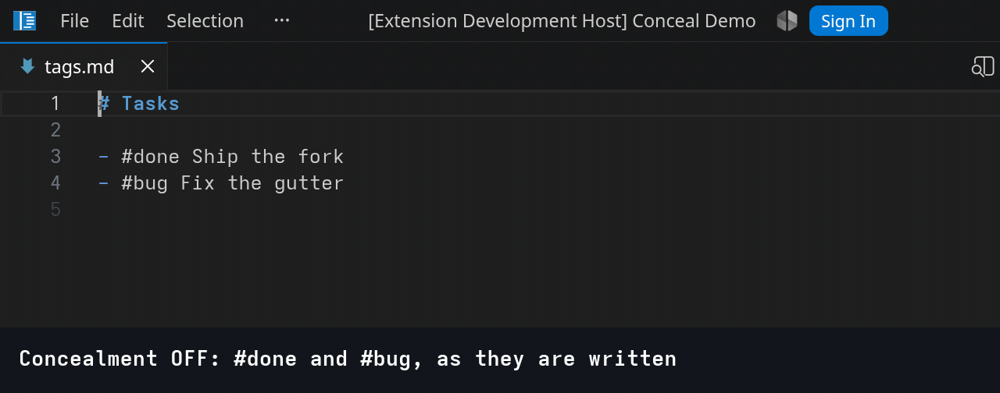

One rule and one decoration type per glyph. The table is fixed, so the cost is fixed with it.

### 12 — TypeScript — `=>` as ⇒

[1-replace/arrows.ts](1-replace/arrows.ts) · rule `ts-fat-arrow`

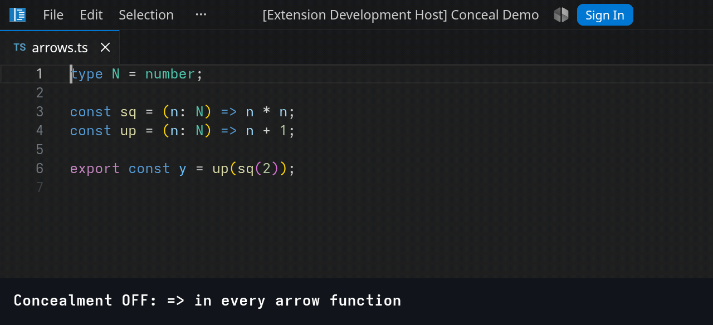

The same shape in a language with a compiler behind it, which is the point of cutting the survey by
behaviour: the API does not know what a language is, and nothing here is aware that a `=>` means
anything.

### 13 — LaTeX — commands as their glyphs

[1-replace/math.tex](1-replace/math.tex) · rules `tex-forall`, `tex-in`, `tex-alpha`, `tex-beta`,
`tex-gamma`, `tex-rightarrow`

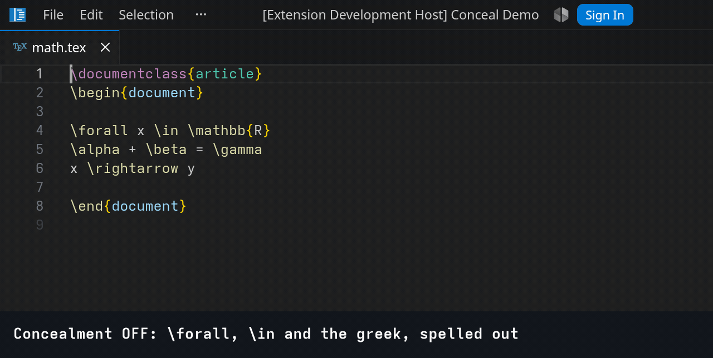

`\mathbb{R}` stays as it is, and that is the honest shape of the case: what is not in the table is
not drawn. A table big enough for real TeX is a long settings file, not a hard one.

### 14 — Lisp — `lambda` as λ

[1-replace/lambda.el](1-replace/lambda.el) · rules `lisp-lambda`, `lisp-ge`

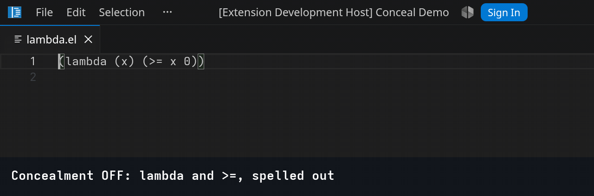

Emacs' `prettify-symbols-mode`, reached by two regular expressions.

## 2 — Caret behaviour

The same files, and the half no extension can implement. Eight beats each: the caret to the right
of a drawn glyph, one arrow press left, one back, Backspace, Ctrl+Z, then ← again — a frame of its
own, so the caret is *seen* arriving on the other side rather than appearing there — Delete, and
then concealment off, because a delete that takes characters nobody can see leaves nothing on
screen to say it happened. A drawn glyph has a caret stop on each side and crossing it costs one
keypress per side; deleting it takes every character it stands for, in one step and one undo, and
the last frame is the file with the concealment lifted, proving it took the text and not the
picture.

### 21 — Crossing and deleting a drawn glyph

[2-caret/lambda.el](2-caret/lambda.el) · rules `lisp-lambda`, `lisp-ge`

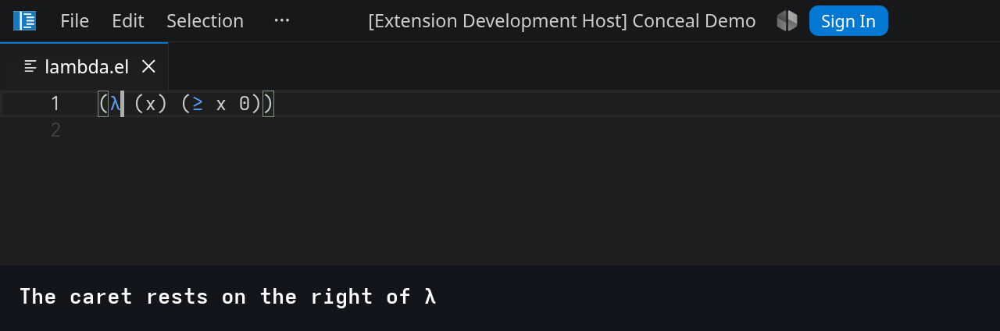

### 22 — Crossing and deleting a TeX command

[2-caret/math.tex](2-caret/math.tex) · rules `tex-forall`, `tex-in`, `tex-alpha`, `tex-beta`,
`tex-gamma`, `tex-rightarrow`

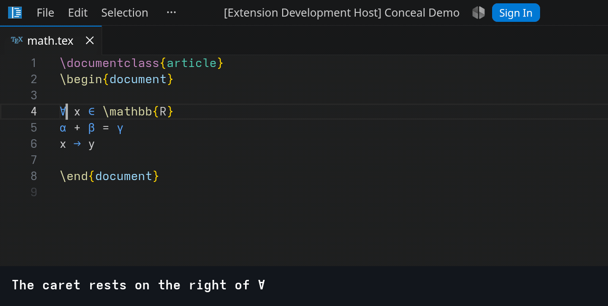

Seven characters behind one glyph, in a file where most of what is on screen — `\documentclass`,
`\mathbb{R}` — is not concealed at all, so the concealed run has to be found by moving the caret
into it.

### 23 — Crossing and deleting an icon

[2-caret/tags.md](2-caret/tags.md) · rules `tag-done`, `tag-bug`

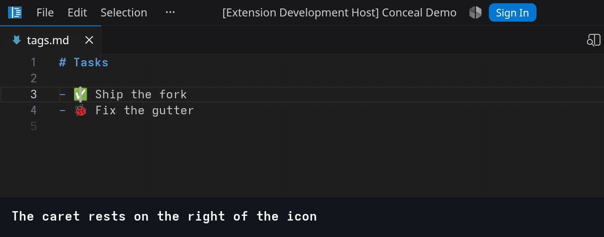

**⚠️ This gif shows a rendering bug, and it is why the icon comes last.** Watch the caret at the
right of `✅`: it is painted **through the middle of the glyph**, green on both sides of it. A
replacement is injected text, and injected text is laid out by its UTF-16 code-unit count rather
than by how wide it is painted. `✅` (U+2705) is *one* code unit and about two cells wide, so its
two caret stops sit one column apart while the glyph occupies two. `🐞` on the line below is a
surrogate pair — two code units, two cells — and renders correctly by accident, which is the whole
tell.

The editing is right throughout: Backspace at that stop still takes the whole tag, Delete still
points away from it. Only the painting is wrong — but it makes a correct delete read as a wrong
one, and no configuration avoids it except by never drawing a glyph whose code-unit count and cell
width disagree. See
[conceal-api-rnd/06 § F8](../../jin/documentation/conceal-api-rnd/06-explore-via-conceal-demo-extension.md).

## 3 — Invisible markers

Nothing is drawn, so the range collapses to a single screen position and `cursorStop` decides which
one. [notes.md](3-invisible-markers/notes.md) holds four records in the two shapes a note takes —
two list items, a blank line, two paragraphs — and two of them carry a drawn tag as well, so a
hidden marker and a replacement share a line and neither knows about the other. `{ID:A3BF9Z}`
rather than jin's own `{!A3BF9Z}`: the syntax is the task's, not jin's, so the demo does not read as
a jin feature.

Rules: `md-id`, plus `tag-done` and `tag-bug` from section 1.

### 31 — A caret with nothing to cross

[3-invisible-markers/notes.md](3-invisible-markers/notes.md)

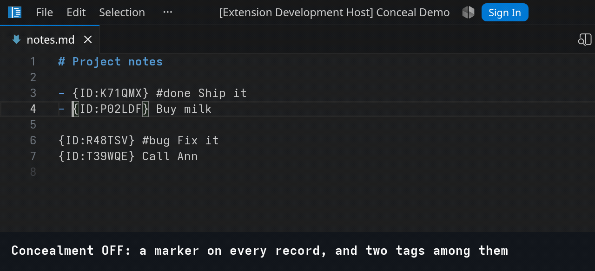

Both shapes, one after the other, and the list item is shown with one press left and two back so
the two kinds of press can be compared. Every press moves the caret exactly one cell on screen: ←
steps into the gap after the dash, the first → steps back onto the marker's edge, and the second
steps past the word's first letter — carrying the caret thirteen characters through the file on the
way, twelve of them the marker's. Concealment off is what shows where it really went. On a
paragraph the marker's one stop is column 1, so a single ← leaves the line altogether. Twelve
characters, and not one caret stop among them — which is also why nothing can be typed inside a
marker.

### 32 — What a delete takes, and what the clipboard carries

[3-invisible-markers/notes.md](3-invisible-markers/notes.md)

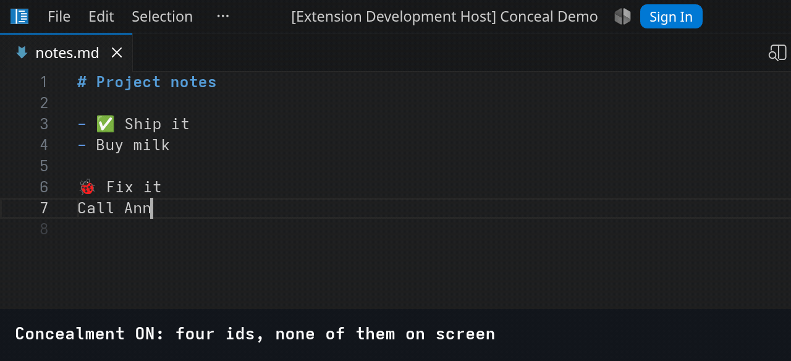

Ordinary editing does not touch a marker: Ctrl+Backspace erases the record's words and stops at
text it cannot see, twice over, until the record looks empty and its id is still in it.

**⚠️ Then the gif shows a bug, on purpose.** One Delete at that same place takes all twelve hidden
characters, and because they were never on screen, nothing on screen says so — turning concealment
off is the only way to see it happened. Which key does it is decided by `cursorStop`, and there is
no value that is safe in both directions:

| `cursorStop` | Backspace at the caret's one stop | Delete at the same stop |
| --- | --- | --- |
| `"before"` — what `md-id` uses | takes the ordinary character in front; the marker survives | **takes the whole marker** |
| `"after"` | **takes the whole marker** | takes the ordinary character behind; the marker survives |

Both rows are measured against the fork in
[interaction.test.ts](../src/test/integration/interaction.test.ts), not reasoned about. The
editor's rule is deliberate — a deletion reaching into a concealed range takes *all* of it, in one
step and one undo, so a marker can never be cut in half and left half-matching. What the API has no
way to say is **"this range is not editable at all"**: that would be a new concept, not a rule
property, and no configuration reaches it today.

The last frame is the other half of the same fact: copy the record and the id comes with it, having
never been on screen. What the clipboard carries is what is on disk.

### 33 — A line break in front of one

[3-invisible-markers/notes.md](3-invisible-markers/notes.md)

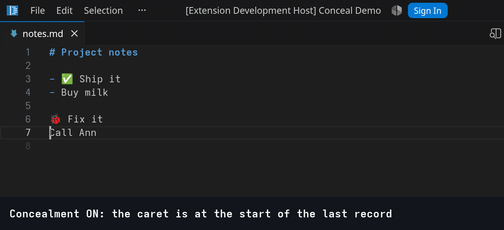

`cursorStop: "before"` puts the caret to the *left* of the marker, so Enter at the start of a line
splits in front of it and the id travels down with the text it belongs to, still starting its
record and still matching.

## 4 — Hide markup

Markup a reader already understands, taken out of the view with nothing drawn in its place: the
line simply closes up over it. Two rules per delimiter, each with a lookaround for its partner. A
single `\*\*` rule looks equivalent and is not: it conceals an orphan, so deleting half a pair
leaves the file broken and the screen unchanged. See
[conceal-api-rnd/07](../../jin/documentation/conceal-api-rnd/07-markdown-markup-conceal.md) § M1.

These six rules take the default `cursorStop: "after"`, so the caret rests to the *right* of a
concealed delimiter and Backspace reaches it. That is what `cursorStop` is for, and it is a choice
with no safe answer: `"before"` puts the caret on the delimiter's left, where Backspace takes the
ordinary character in front of it and Delete is the key that takes the markup. Whichever is chosen,
one of the two directions surprises somebody.

The default costs one more thing, visible in 41: **the bold line loses its number in the gutter.**
The editor draws a number only where view column 1 maps back to model column 1, and a line that
starts with a concealed `**` under `"after"` maps column 1 past it — so the row reads as a wrapped
continuation of the line above. `cursorStop: "before"` brings the number back, which is why
[3 — invisible markers](#3--invisible-markers) uses it, and it takes Backspace away in exchange.

**⚠️ Both recordings show a bug, on purpose.** Backspace takes the whole delimiter it reaches — but
only that one. Its partner stays in the file, so one keypress turns valid markdown into invalid
markdown, and no keystroke removes both halves. What saves the reader is the pair rules: the orphan
stops matching and appears, so the damage is on screen instead of hidden. Fixing the delete itself
needs the API to let two ranges declare themselves one unit; see
[conceal-api-rnd/07 § M4](../../jin/documentation/conceal-api-rnd/07-markdown-markup-conceal.md).
The frames where it happens are captioned `BUG:`.

### 41 — Markdown emphasis delimiters

[4-hide-markup/emphasis.md](4-hide-markup/emphasis.md) · rules `md-bold-open`/`-close`,
`md-italic-open`/`-close`, `md-tick-open`/`-close`

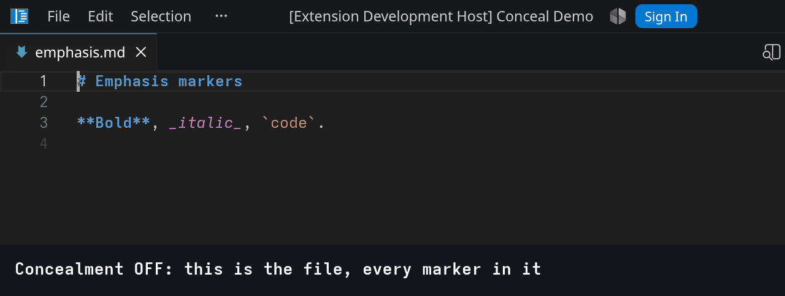

### 42 — JSON quotes

[4-hide-markup/config.json](4-hide-markup/config.json) · rules `json-key-open`/`-close`,
`json-value-open`/`-close`

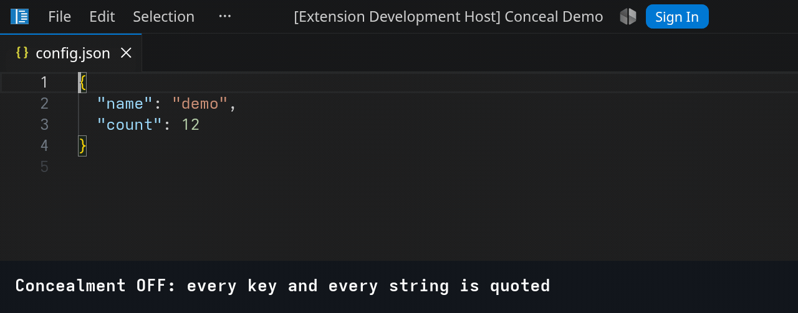

Traced to `vim-json`, which conceals the quotes around **string values as well as keys** — the
"CoffeeScript-inspired look (CSON!)" of its README. What it also does and this does not is reveal
them on the line the cursor is on: that is `reveal: "line"`, a rule property, and it is left out
here so the delete has nothing standing in front of it.

## Fixtures

[fixtures/](fixtures) is not demo material and has no recordings. Those files exist so the
integration suite has something with known line numbers and known offsets to drive real editor
commands against, and so the two limits the API imposes — the 16-character replacement cap and one
decoration type per string drawn — are asserted against a file rather than described.

## Running them

The rules are scoped by `conceal-demo.include`, which defaults to `["**/examples/**"]`. Opening
this folder as the workspace is therefore enough, and nothing outside it is touched.
